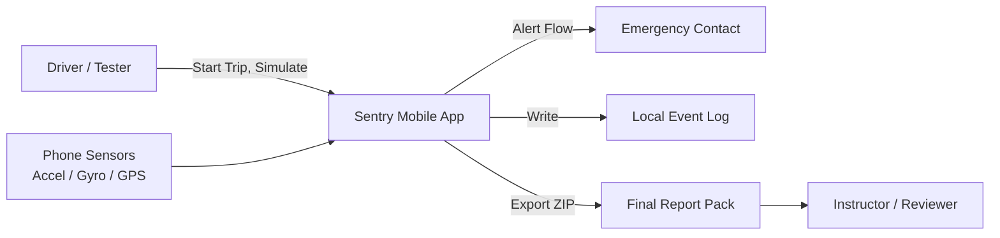
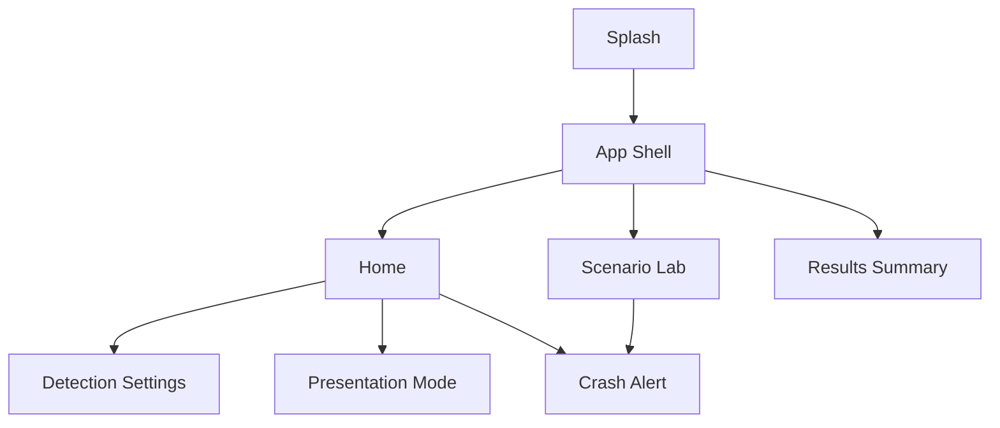
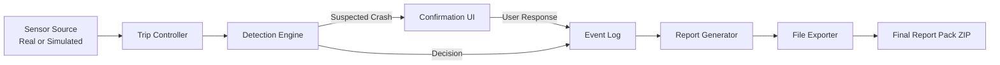
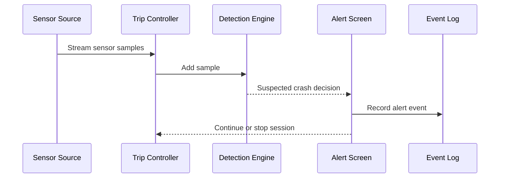
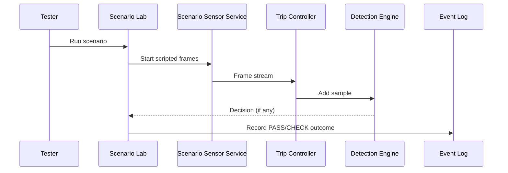
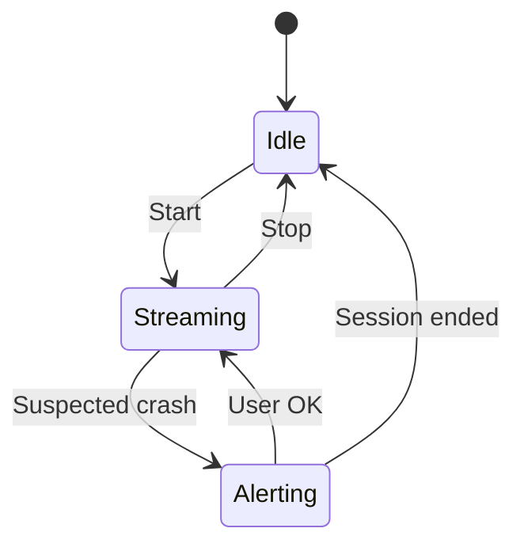
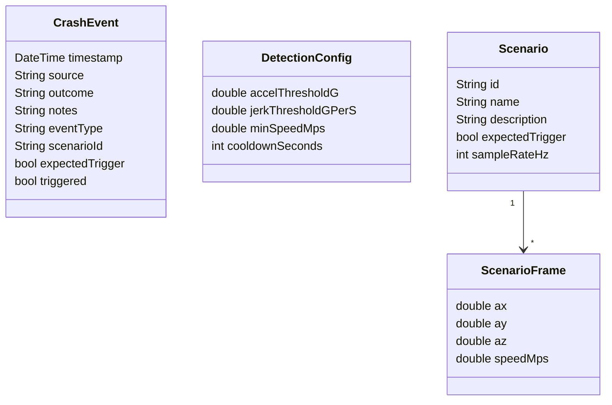
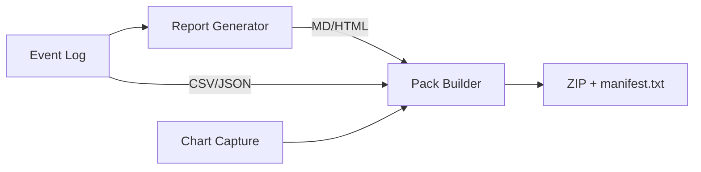

# Diagrams (Mermaid)

Use these Mermaid diagrams in your report or slides. They render in many Markdown
viewers (GitHub, VS Code extensions, Obsidian).

## System Context


## App Navigation Map


## Runtime Data Flow


## Detection Algorithm (Decision Logic)
```mermaid
flowchart TD
  S[Sensor Sample] --> A[Compute magnitude |a|]
  A --> B[Compute jerk = (|a|-|a_prev|)/dt]
  B --> C{Cooldown active?}
  C -- Yes --> X[Ignore]
  C -- No --> D{Speed >= minSpeed?}
  D -- No --> X
  D -- Yes --> E{Magnitude >= accelThreshold?}
  E -- No --> X
  E -- Yes --> F{Jerk >= jerkThreshold?}
  F -- No --> X
  F -- Yes --> G[Emit crash decision]
  G --> H[Show Alert UI]
  H --> I[Log event]
```

## Signal Processing (Magnitude + Jerk)
```mermaid
flowchart LR
  AX[ax] --> MAG[|a| = sqrt(ax^2 + ay^2 + az^2)]
  AY[ay] --> MAG
  AZ[az] --> MAG
  MAG --> DELTA[delta = |a| - |a_prev|]
  DT[dt seconds] --> JERK[jerk = delta / dt]
  MAG --> THRESH[Threshold gates]
  JERK --> THRESH
```

## Sequence: Crash Alert


## Sequence: Scenario Lab Run


## State Machine: Trip Controller


## Data Model (Core)


## Report Pack Pipeline


## Deployment Targets
```mermaid
flowchart LR
  Flutter[Flutter App] --> Web[Web (Chrome)]
  Flutter --> Windows[Windows Desktop]
  Flutter --> Android[Android Device / Emulator]
```
