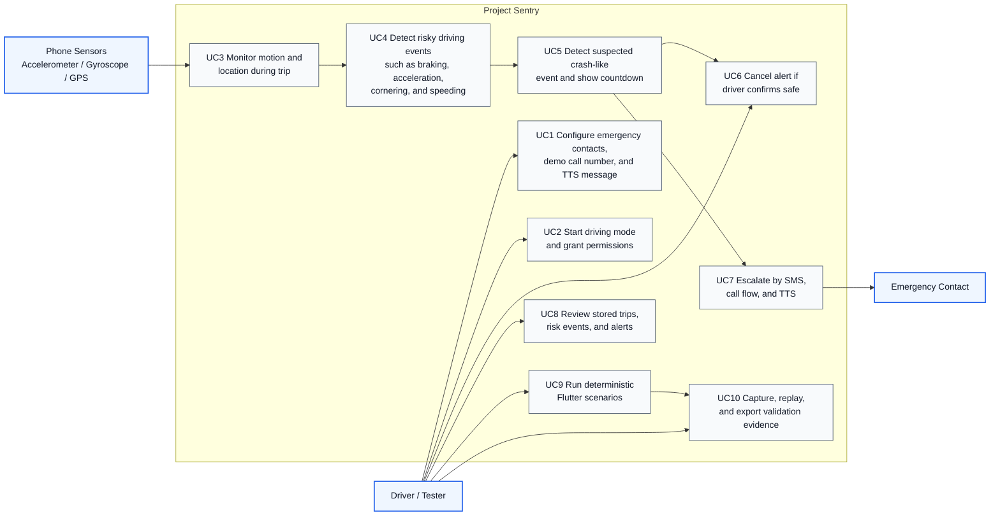
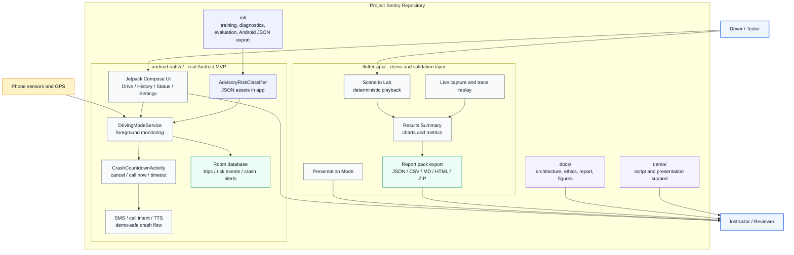
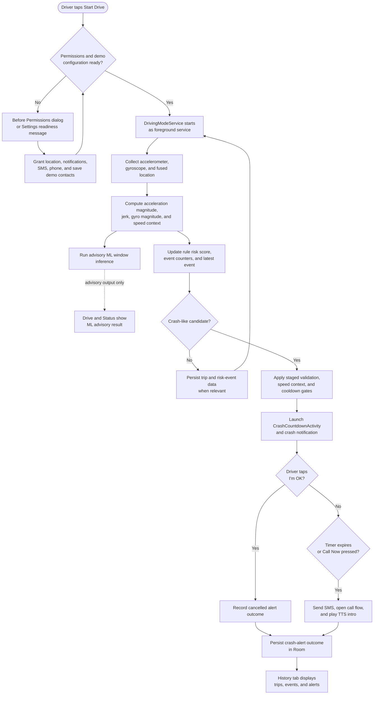
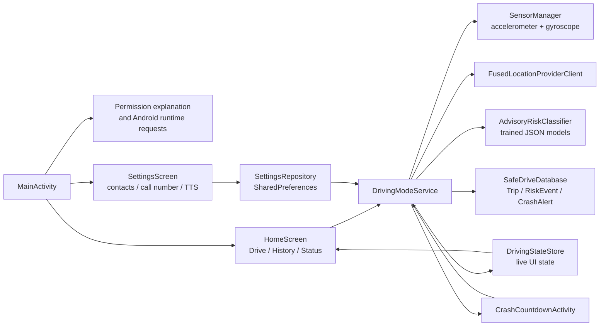
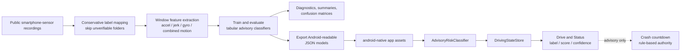
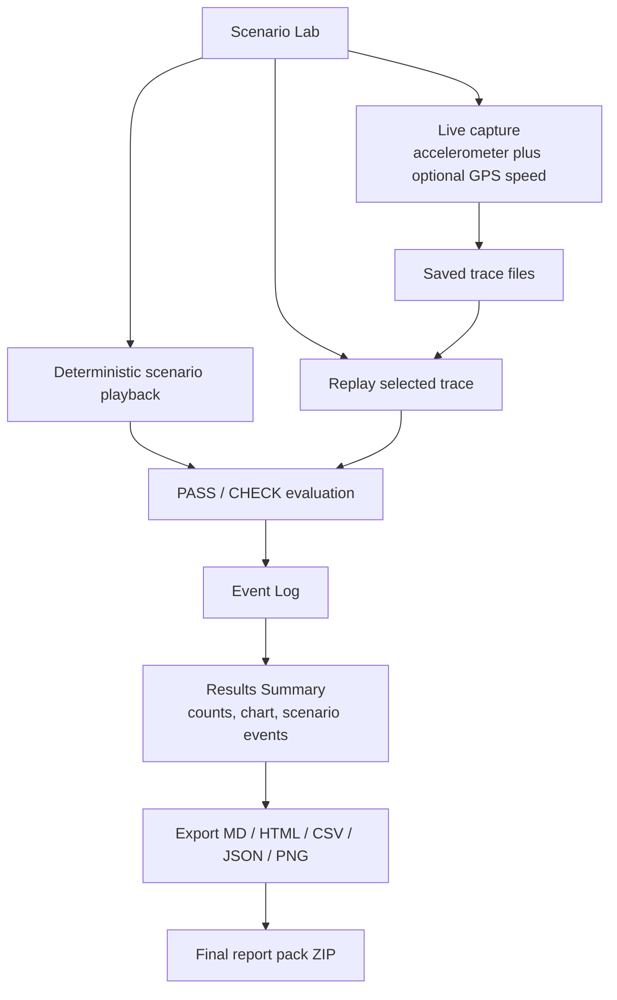
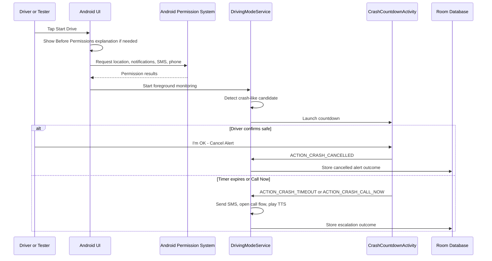
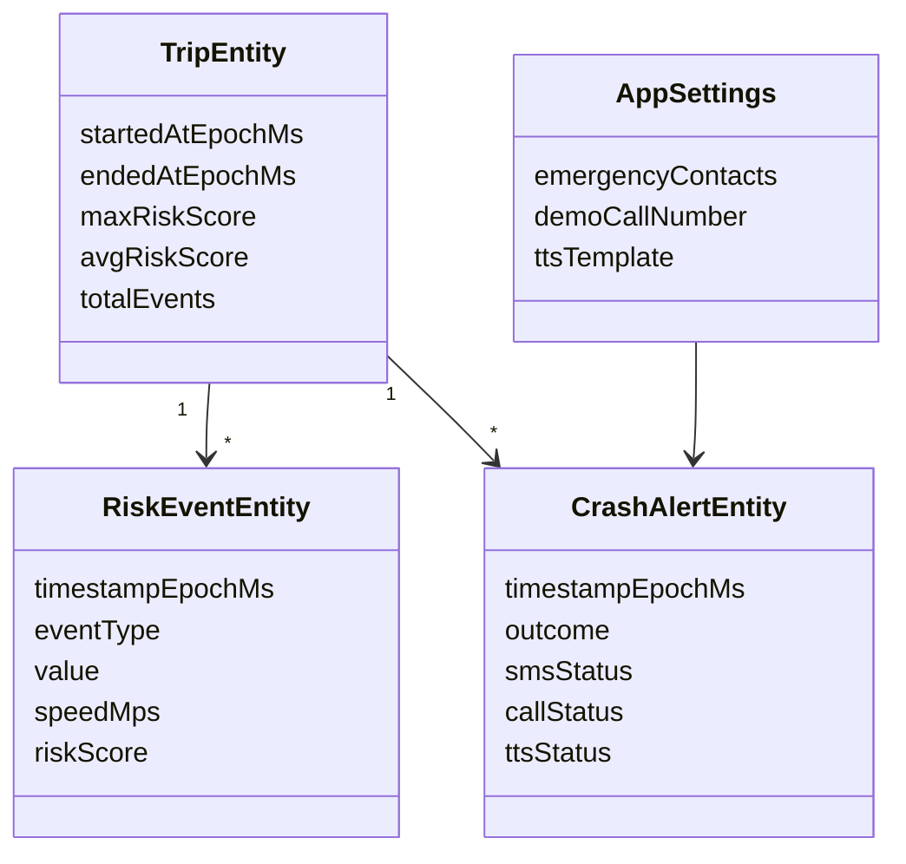

# Diagrams (Mermaid)

The first three diagrams below map directly to the final report figure list:

- Figure 1. Project Sentry use-case diagram.
- Figure 2. Project Sentry system architecture.
- Figure 3. Crash-detection and escalation runtime flow.

Use these Mermaid blocks in the final report, slides, or exported report pack.
Render them as high-resolution PNG/SVG before inserting them into Word or PDF.

## Figure 1: Project Sentry Use-Case Diagram

## Figure 2: Project Sentry System Architecture

## Figure 3: Crash-Detection And Escalation Runtime Flow

## Android Runtime Architecture

## Advisory ML Training And Android Export

## Flutter Validation And Report-Pack Flow

## Permission And Crash Flow Sequence

## Core Persistence Model

