# Project Sentry Final Report

This final report follows the CSC599 final report structure extracted from `CSC599 - Grading Rubric (1).pdf` on April 26, 2026. It is written from repository evidence, preserved research notes, official product/documentation sources, captured screenshots, exported diagrams, and generated report artifacts.

## Preliminary Pages

### Title Page

- Project Title: **Project Sentry**
- Student Name(s): **Jawad Saad, Hicham Saad**
- Student ID(s): **202208111, 202208901**
- Supervisor/Advisor: **Dr. Mohamed Watfa**
- Department: **Computer Science**
- Course: **CSC599 - Capstone Project**
- Semester: **Spring 2026**
- Submission Date: **30/4/2026**

### Signature Page

- Student signatures: **Jawad Saad: ____________ ; Hicham Saad: ____________**
- Supervisor/advisor signature: **Dr. Mohamed Watfa: ____________**
- Coordinator signature / department approval field: **____________**

### Acknowledgments

We would like to thank Dr. Mohamed Watfa for supervising this capstone and for emphasizing rigorous documentation, clear scope definition, and a defensible connection between the technical prototype and the wider software-development lifecycle. We also acknowledge the role of the broader repository documentation effort in helping convert implementation work, validation notes, and research findings into a coherent final report.

### Abstract

Project Sentry is a smartphone-based road-safety system that detects crash-like events and risky driving behavior using onboard sensors, speed context, and a human-in-the-loop emergency escalation flow. The project was motivated by the continuing public-health burden of road traffic injuries, the widespread availability of smartphones, and the practical need for a transparent crash-response workflow that does not depend on dedicated in-vehicle hardware (National Highway Traffic Safety Administration [NHTSA], 2026; Pew Research Center, 2025; World Health Organization, 2023). The initial implementation direction emphasized Flutter because it enabled rapid interface prototyping, deterministic scenario simulation, and polished capstone presentation screens. As the project matured, however, the team determined that the runtime-critical responsibilities of the system were better handled natively on Android. Foreground/background driving monitoring, runtime permissions, fused location updates, telephony actions, text-to-speech escalation, and persistent local storage are all tightly coupled to Android platform behavior. The final capstone direction therefore treats the native Android application as the functional MVP while retaining the Flutter application as an earlier prototype, validation environment, and presentation layer.

The current repository demonstrates both sides of that architecture. The Android native MVP includes a foreground driving service, accelerometer and gyroscope monitoring, fused location tracking, staged crash validation, a countdown confirmation screen, SMS/call/TTS escalation, an advisory machine-learning risk classifier, and Room-backed storage of trips, risk events, and crash alert outcomes. The Flutter application provides scenario playback, live trace capture, replay-based validation, automated tests for core modules, and report-pack generation for capstone evidence. The overall contribution of Project Sentry is therefore not a claim of production-certified emergency automation; it is a functional, engineering-driven MVP that combines mobile sensing, structured validation, local-first safety workflow design, and a conservative advisory ML layer. Current evaluation supports build verification, scenario-based validation tooling, an end-to-end countdown/escalation workflow, repository-backed ML model metrics, and captured visual evidence, while larger quantitative field metrics and broader device-level testing remain future work.

### Table of Contents

| Section | Title |
| --- | --- |
| 1 | Introduction |
| 1.1 | Background and Motivation |
| 1.2 | Problem Statement |
| 1.3 | Practical and Research Gap |
| 1.4 | Project Objectives |
| 1.5 | Significance and Potential Impact |
| 2 | Literature Review / Related Work |
| 2.1 | Existing Crash Detection Systems |
| 2.2 | Smartphone-Based Crash Detection |
| 2.3 | Driver Behavior and Risk Prediction |
| 2.4 | Telematics and Safe-Driving Apps |
| 2.5 | Gap Analysis |
| 2.6 | Positioning of This Project |
| 3 | System Analysis and Design |
| 3.1 | Requirements Analysis |
| 3.2 | Use Cases |
| 3.3 | System Architecture |
| 3.4 | Android-Native Architecture |
| 3.5 | Flutter Prototype Role |
| 3.6 | Feasibility and Risk Analysis |
| 3.7 | Ethical and Privacy Considerations |
| 4 | Implementation |
| 4.1 | Development Methodology |
| 4.2 | Tools and Technologies |
| 4.3 | Android Native Modules |
| 4.4 | Flutter Prototype |
| 4.5 | Advisory ML and Risk Prevention |
| 4.6 | Screenshots and Captured Figures |
| 5 | Testing and Evaluation |
| 5.1 | Test Plan |
| 5.2 | Unit Testing Plan |
| 5.3 | Integration Testing Plan |
| 5.4 | System Testing Plan |
| 5.5 | Permission-Flow Testing |
| 5.6 | Crash Simulation Testing |
| 5.7 | Risk-Event and Advisory-ML Testing |
| 5.8 | Emulator vs Physical Device Testing |
| 5.9 | Current Verified Evidence |
| 5.10 | Evaluation Metrics and Current Status |
| 6 | Entrepreneurial / Innovation Aspects |
| 6.1 | Market Relevance |
| 6.2 | Existing Market Systems |
| 6.3 | Why This Project Is Still Valuable |
| 6.4 | Survey Evidence |
| 6.5 | Possible Commercialization |
| 6.6 | Deployment and Scalability |
| 6.7 | Societal and Ethical Impact |
| 7 | Project Management and Teamwork |
| 7.1 | Team Roles |
| 7.2 | Timeline |
| 7.3 | Milestones |
| 7.4 | GitHub Collaboration |
| 7.5 | Resource Management |
| 7.6 | Advisor Context and Interaction Limits |
| 8 | Results and Discussion |
| 8.1 | Current Achieved Outcomes |
| 8.2 | Comparison to Objectives |
| 8.3 | Strengths |
| 8.4 | Limitations |
| 8.5 | Lessons Learned |
| 8.6 | Discussion of the Flutter-to-Android Pivot |
| 9 | Conclusion and Future Work |
| 9.1 | Summary of Contributions |
| 9.2 | Future Improvements |
| References | References |
| Appendix A | Installation Guide |
| Appendix B | User Manual |
| Appendix C | Structured Test Cases |
| Appendix D | Dataset and Model Details |
| Appendix E | GitHub and Repository Structure |
| Appendix F | Complete Survey Screenshot Sequence |

### List of Figures

| Figure | Caption |
| --- | --- |
| Figure 1 | Project Sentry use-case diagram |
| Figure 2 | Project Sentry system architecture |
| Figure 3 | Crash-detection and escalation runtime flow |
| Figure 4 | Android Drive tab during active monitoring (parts 1-2) |
| Figure 5 | Android Settings screen with crash-flow configuration (parts 1-2) |
| Figure 6 | Android crash countdown and escalation confirmation screen |
| Figure 7 | Android History tab with persisted trips and alert logs (parts 1-2) |
| Figure 8 | Android Status tab showing permissions and readiness (parts 1-2) |
| Figure 9 | Flutter Scenario Lab with deterministic playback controls and validation tools |
| Figure 10 | Combined into Figure 9 because the same screenshot includes the live-capture validation card |
| Figure 11 | Flutter Results Summary screen with evaluation metrics (parts 1-2) |
| Figure 12 | Flutter Presentation Mode screen used in capstone demos |
| Figure 13 | VS Code view of exported report-pack artifacts |
| Figure 14 | Android first-run permission request sequence |
| Figure 15 | Omitted as redundant with Figures 8 and 14 |
| Figure 16 | Survey response overview for Project Sentry |
| Figure 17 | Survey response charts for trust, privacy, and adoption questions (parts 1-9) |
| Figure 18 | Survey open-ended response themes |
| Figure F.1 | Survey results sequence, part 1 |
| Figure F.2 | Survey results sequence, part 2 |
| Figure F.3 | Survey results sequence, part 3 |
| Figure F.4 | Survey results sequence, part 4 |
| Figure F.5 | Survey results sequence, part 5 |
| Figure F.6 | Survey results sequence, part 6 |
| Figure F.7 | Survey results sequence, part 7 |
| Figure F.8 | Survey results sequence, part 8 |
| Figure F.9 | Survey results sequence, part 9 |
| Figure F.10 | Survey results sequence, part 10 |
| Figure F.11 | Survey results sequence, part 11 |

### List of Tables

| Table | Caption |
| --- | --- |
| Table 1 | Consolidated requirements for Project Sentry |
| Table 2 | Repository areas and primary responsibilities |
| Table 3 | Repository-backed development timeline for Project Sentry |
| Table 4 | Technologies used across the Project Sentry repository |
| Table 5 | Advisory ML evaluation summary |
| Table 6 | Current evaluation metrics and future validation needs |
| Table 7 | Competitor comparison across mainstream smartphone crash-detection systems |
| Table 8 | Team roles and repository-backed ownership areas |
| Table 9 | Repository-backed project timeline and milestones |
| Table 10 | Comparison between stated objectives and achieved outcomes |
| Table C.1 | Core Android-native test cases |
| Table C.2 | Core Flutter validation test cases |
| Table C.3 | Advisory ML test cases |

## 1. Introduction

### 1.1 Background and Motivation

Road traffic injuries remain a serious public-safety problem. The World Health Organization (2023) reports that approximately 1.19 million people die each year in road traffic crashes, with between 20 and 50 million more suffering non-fatal injuries, and notes that road crashes cost most countries about 3% of gross domestic product. For Project Sentry, however, the most immediate concern is Lebanon. WHO's Lebanon road-safety materials describe chaotic mixed traffic conditions, serious underreporting in crash data, and weak enforcement across core safety behaviors such as speed control, seat-belt use, and helmet compliance (World Health Organization, 2015; World Health Organization, Regional Office for the Eastern Mediterranean [WHO EMRO], n.d.). That local context makes road safety not only a transport issue but also a detection, communication, and post-crash response problem for Lebanese drivers, passengers, and families.

The motivation for Project Sentry is therefore not merely technological curiosity. It is rooted in the observation that modern phones already include accelerometers, gyroscopes, location services, storage, and communication capabilities that can support low-cost monitoring and post-incident response without requiring dedicated in-vehicle hardware. Smartphones are already carried by most adults in large consumer markets; for example, Pew Research Center (2025) reports that 91% of U.S. adults own a smartphone. Commercial products from Apple and Google further demonstrate that severe-collision detection is technically viable on mainstream consumer devices (Apple, n.d.; Google, n.d.). For Lebanon specifically, this makes a smartphone-centered safety system attractive because it lowers hardware cost, fits existing user behavior, and creates a path toward faster local alerting in a road environment where enforcement and reporting remain inconsistent.

### 1.2 Problem Statement

The problem addressed by Project Sentry is the need for an accessible mobile system that can monitor driving behavior, detect potentially severe impact events, and initiate a controlled emergency-response workflow without requiring dedicated in-vehicle hardware. This need is especially relevant in Lebanon, where the project is intended to serve a local population facing weak road-safety enforcement, underreported crash harm, and inconsistent compliance with basic protective behaviors (World Health Organization, 2015; WHO EMRO, n.d.). The challenge is not only to detect abnormal motion, but to do so in a way that is transparent, testable, privacy-conscious, and practical on real Android devices. Crash-like motion can be confused with harsh braking, potholes, phone handling, or cornering, so the system must balance sensitivity with false-alarm reduction. In addition, the application must operate within Android's foreground-service, permission, notification, and telephony constraints rather than assuming an idealized laboratory environment.

### 1.3 Practical and Research Gap

The repository evidence suggests three concrete gaps.

First, there is a practical product gap. Commercial crash-detection features exist, but they are often tied to specific hardware ecosystems, proprietary implementation details, or premium-device assumptions (Apple, n.d.; Google, n.d.). For an educational capstone, that makes it difficult to inspect the decision logic, justify design tradeoffs, or adapt the workflow to a different mobile context.

Second, there is a research-data gap. The project’s validation notes show that public smartphone datasets are far stronger for aggressive-driving analysis, road anomalies, and telematics-style monitoring than for true severe-collision ground truth. Ferreira Júnior et al. (2017) and the `driverBehaviorDataset` repository preserved in the project notes are useful for aggressive maneuvers and labeled sensor windows, while Khandakar et al. (2025) provide a broad smartphone-sensor dataset for road-safety research. However, neither source by itself solves the severe-collision validation problem for a capstone-scale emergency-detection app. A defensible approach therefore needs transparent heuristics, safe scenario simulation, controlled trace collection, and explicit limitation reporting rather than overstated claims.

Third, there is a software-architecture gap specific to this project. Cross-platform UI technology is valuable for prototyping and presentation, but the final system also requires Android-native capabilities such as reliable foreground/background service behavior, fused location updates, runtime permission handling, SMS/call/TTS escalation, and persistent local storage. This gap directly motivated the project’s pivot from Flutter-first prototyping to an Android-native runtime MVP supported by a separate Flutter validation layer.

### 1.4 Project Objectives

The current project objectives are:

1. Design a smartphone-based system that can monitor driving-related signals and flag crash-like events or risky driving conditions.
2. Provide a native Android MVP capable of running foreground monitoring, handling permissions, and performing local emergency escalation actions.
3. Provide a separate validation and presentation layer that supports scenario playback, trace capture, replay, and report generation.
4. Keep the system privacy-conscious by storing data locally and avoiding unnecessary cloud dependency in the MVP stage.
5. Document limitations honestly and avoid overstating production readiness, advisory machine-learning maturity, or emergency-service reliability.
6. Integrate advisory machine-learning only where it supports risk explanation without replacing the safer rule-based crash flow, and leave a clear path for richer reporting and broader validation.

### 1.5 Significance and Potential Impact

Project Sentry is significant in three ways. From an educational perspective, it demonstrates how mobile sensing, event detection, UI workflow design, local persistence, and platform constraints interact in one capstone project. From an engineering perspective, it shows that a safety-oriented system can be structured honestly by separating simulation/reporting concerns from runtime-critical Android behavior. From a practical perspective, it offers a low-cost foundation that is especially relevant to the Lebanese population, where a smartphone-first approach is more realistic than specialized vehicle hardware and where better local alerting, trip evidence, and post-crash communication could have meaningful real-world value.

## 2. Literature Review / Related Work

This literature review combines the repository’s preserved research notes with official product sources and peer-reviewed work. Its purpose is not to imply that Project Sentry is already equivalent to commercial emergency systems. Rather, it positions the project inside the existing landscape of mobile crash detection, telematics, and smartphone-sensor road-safety research.

### 2.1 Existing Crash Detection Systems

Apple Crash Detection, Google Pixel Car Crash Detection, and Life360 are important reference points because they demonstrate that the problem space is already commercially meaningful. Apple’s implementation on iPhone 14 or later can detect a severe car crash, display a visible alert, and automatically place an emergency call if the user does not cancel within the countdown window; it can also notify emergency contacts and share location information (Apple, n.d.). Google’s Pixel implementation similarly uses phone context such as location, motion sensors, and nearby sounds to identify possible severe crashes and can place emergency-service calls through Emergency Location Service (Google, n.d.). Life360 approaches the same space from a family-safety perspective, combining crash detection, emergency contacts, location sharing, and a subscription-supported safety platform with large market reach (Life360, n.d.-a, n.d.-b, 2025).

These systems matter to Project Sentry in two ways. First, they confirm that smartphone-based safety sensing is not a speculative idea. Second, they highlight the differentiation challenge for a capstone project: commercial products are closed, polished, and supported by platform-scale infrastructure, whereas an academic prototype must focus on transparency, explainability, and defensible scope.

### 2.2 Smartphone-Based Crash Detection

Smartphone-based crash detection typically relies on some combination of inertial sensing, contextual speed/location information, temporal filtering, and event thresholds. In academic work, this broader family of approaches overlaps with driver-behavior profiling, road-anomaly sensing, and telematics. Ferreira Júnior et al. (2017) show that Android smartphone sensors can support machine-learning-based classification of aggressive driving events, while Khandakar et al. (2025) argue that richer multi-sensor datasets are valuable for studying both road conditions and driving behavior. These sources support the idea that phone-based sensing is technically useful, but they also show that sensor interpretation depends heavily on feature design, sampling quality, device placement, and labeling quality.

Project Sentry reflects that literature in simplified form. The Flutter prototype uses a transparent threshold detector based on acceleration magnitude, jerk, minimum speed, and cooldown. The Android native MVP takes a more defensive approach by combining impact evidence with short validation windows and speed-based checks before launching the crash countdown. This design aligns with a key lesson from both literature and commercial systems: raw spikes alone are not enough. Google’s own product explanation emphasizes that car-crash detection uses multiple signals, not just one sensor reading (Google, n.d.). The capstone system therefore adopts a transparent heuristic baseline rather than pretending that a single threshold is sufficient.

### 2.3 Driver Behavior and Risk Prediction

The preserved research notes identify aggressive-driving datasets and telematics-oriented datasets as much more available than true open crash datasets. The `driverBehaviorDataset` repository contains smartphone sensor traces for labeled aggressive and non-aggressive maneuvers using a windshield-mounted phone, synchronized event labeling, and multiple inertial sensors (`jair-jr`, n.d.). Ferreira Júnior et al. (2017) use this dataset context to study driver-behavior profiling with Android smartphone sensors and machine learning. Khandakar et al. (2025) extend the conversation by publishing a broader smartphone-sensor dataset covering road safety, anomalies, and driver behavior across a more comprehensive sensor set.

These sources are highly relevant to Project Sentry because the native Android MVP does more than detect crash-like events. It also tracks harsh braking, harsh acceleration, sharp cornering, and speeding as risk events. In other words, even when severe-collision data is limited, the surrounding driver-risk problem is still rich enough to support meaningful sensing, logging, and validation work.

The latest implementation uses that distinction directly. Project Sentry now treats machine learning as an advisory driver-risk and road-condition layer rather than as the authority for emergency escalation. This keeps the trained model aligned with the available public data: it can help label patterns such as `NORMAL`, `AGGRESSIVE`, and `ROAD_ANOMALY`, but it does not claim to identify verified severe crashes.

### 2.4 Telematics and Safe-Driving Apps

The repository also references telematics demo applications and benchmark repositories, especially Android examples from Mobile-Telematics. Their value is less about raw crash-detection algorithms and more about software architecture: trip tracking, permission handling, persistent event logging, and safe-driving dashboards recur across the telematics domain (Mobile-Telematics, n.d.). Project Sentry does not currently implement a full commercial telematics stack, but it shares the same core concerns of continuous sensing, event interpretation, mobile permissions, user trust, and evidence reporting.

### 2.5 Gap Analysis

Based on the current sources, the main gaps are:

- Public open data is much stronger for non-crash driving behavior than for real crash validation.
- Many existing consumer systems are closed, making them unsuitable as transparent teaching artifacts or inspectable engineering case studies.
- A cross-platform prototype can present the product story well, but runtime-critical Android behavior still requires native handling.
- There is room for a local-first, educationally transparent prototype that combines crash response, driver-risk monitoring, and reproducible validation support.

### 2.6 Positioning of This Project

Project Sentry is positioned as an engineering capstone rather than a finished commercial emergency product. Its novelty lies in how it combines:

- an Android-native runtime MVP for realistic platform-level safety behavior,
- a Flutter-based validation and presentation layer for demos and documentation,
- a transparent rule-based crash baseline plus an advisory ML layer for driver-risk and road-condition classification,
- and explicit privacy, ethics, and limitation reporting.

The project does not claim to outperform commercial crash-detection systems. Instead, it aims to provide a defensible, extensible, and well-documented MVP that demonstrates core computer-science theory and software-engineering decision-making while remaining inspectable in ways that commercial black-box systems are not.

## 3. System Analysis and Design

### 3.1 Requirements Analysis

The repository already contains a formal traceability file in `docs/requirements-traceability.md`. Table 1 consolidates the most relevant requirements for the final report.

Table 1. Consolidated requirements for Project Sentry.

| ID | Requirement Summary | Main Owner | Status |
| --- | --- | --- | --- |
| FL-01 | Provide a polished demo and presentation experience | Flutter prototype | Implemented |
| FL-02 | Support deterministic scenario playback | Flutter prototype | Implemented |
| FL-03 | Support live device trace capture for validation | Flutter prototype | Implemented |
| FL-04 | Support replay and PASS/CHECK evaluation of saved traces | Flutter prototype | Implemented |
| FL-05 | Export capstone evidence and report assets | Flutter prototype | Implemented |
| AN-01 | Run continuous driving monitoring in a foreground service | Android native MVP | Implemented |
| AN-02 | Request and use Android runtime permissions safely | Android native MVP | Implemented |
| AN-03 | Persist trips, risk events, and crash alert attempts locally | Android native MVP | Implemented |
| AN-04 | Provide crash countdown and escalation flow | Android native MVP | Implemented |
| AN-05 | Provide settings for contacts, demo number, and TTS | Android native MVP | Implemented |
| AN-06 | Provide native history/export UI comparable to Flutter reporting | Android native MVP | Partial |
| ML-01 | Maintain a shared ML training/export workspace | Shared | Implemented |
| ML-02 | Run advisory risk classification without controlling crash escalation | Android native MVP / `ml/` | Implemented as advisory |

Functional requirements can be summarized as follows:

- start and stop a monitored driving session,
- collect motion and location data while driving mode is active,
- calculate risky-event indicators and crash-like-event candidates,
- present a countdown so the user can cancel or escalate,
- send SMS/open call flow/play TTS for demo-safe escalation,
- persist operational data locally,
- support scenario-based validation and evidence export,
- display advisory ML risk labels, scores, and confidence without making them the crash authority,
- and maintain configurable emergency settings.

Non-functional requirements include:

- reliability under Android foreground-service rules,
- privacy-first local storage,
- transparent and explainable decision logic,
- maintainability through repository separation of concerns,
- safe demo behavior using placeholder or demo-only numbers,
- separation between advisory ML output and rule-based crash escalation,
- and reportability for capstone grading and presentation.

From a computer-science perspective, these requirements decompose the problem into six interacting concerns: continuous data acquisition, feature extraction from sensor streams, temporal decision logic, stateful workflow control, local persistence, and user-facing confirmation/escalation. That decomposition is important because Project Sentry is not only a user-interface exercise. It is a real-time mobile sensing system whose correctness depends on how those subsystems interact under noisy inputs and mobile operating-system constraints.

### 3.2 Use Cases

The main actors are the driver/tester, the mobile application, the phone sensors, and the emergency contact workflow. Key use cases are:

1. Configure emergency contacts, demo call number, and TTS message.
2. Start driving mode and grant required permissions.
3. Monitor accelerometer, gyroscope, and location data during a trip.
4. Detect risky driving events such as harsh braking or speeding.
5. Detect a suspected crash-like event and show a countdown confirmation UI.
6. Cancel the alert if the driver is safe.
7. Escalate through SMS, call intent, and TTS if the driver does not respond.
8. Review recent trips, risk events, and alert outcomes stored in Room.
9. Run deterministic scenarios in the Flutter lab.
10. Capture, replay, and export validation traces and report artifacts.

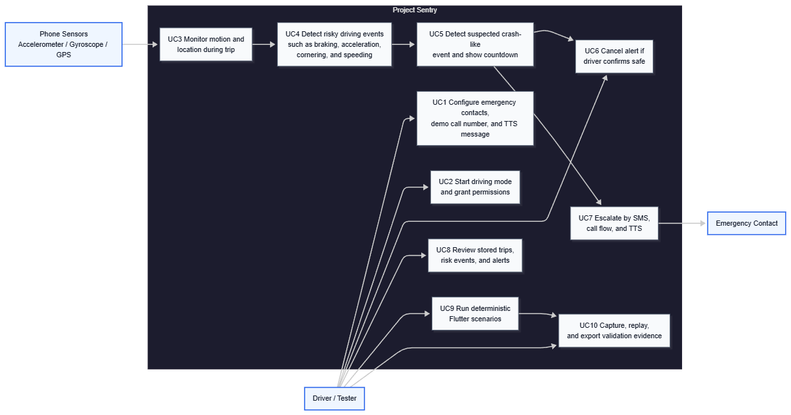

Figure 1. Project Sentry use-case diagram.

### 3.3 System Architecture

Project Sentry is intentionally split into two application layers that share one repository:

Table 2. Repository areas and primary responsibilities.

| Repository Area | Primary Responsibility |
| --- | --- |
| `android-native/` | Real Android runtime, foreground service, permissions, sensors, fused location, Room persistence, crash countdown, SMS/call/TTS |
| `flutter-app/` | UI prototype, scenario simulation, live trace capture, replay-based validation, presentation mode, report exports |
| `docs/` | Architecture, ethics, evaluation, references, research notes, traceability |
| `demo/` | Demo script and class-presentation support |
| `ml/` | Advisory ML training pipeline, diagnostics, evaluation summaries, and exported Android JSON models |

This architecture is a deliberate design choice. Rather than forcing one stack to do everything poorly, the repository preserves the strongest role of each implementation.

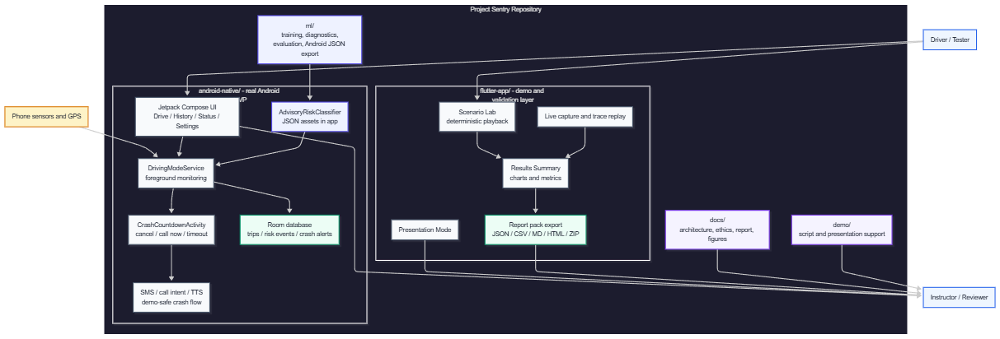

Figure 2. Project Sentry system architecture.

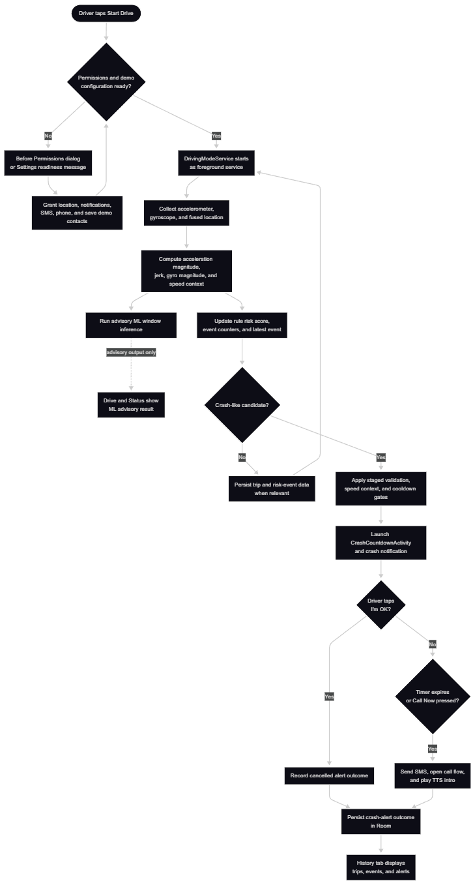

Figure 3. Crash-detection and escalation runtime flow.

### 3.4 Android-Native Architecture

The Android native MVP is the main final product. It is built with Kotlin, Jetpack Compose, Room, and Google Play Services Location. The core runtime responsibilities are handled by `DrivingModeService`, which:

- runs as a foreground service,
- registers accelerometer and gyroscope listeners,
- requests fused location updates,
- calculates risk events and crash candidates,
- publishes live state updates,
- starts the countdown and escalation flow,
- and writes results to local Room tables.

The Android UI layer provides:

- a Drive tab for live monitoring and crash simulation,
- a History tab for locally stored trips/events/alerts,
- a Status tab for preflight readiness and demo checks,
- a Settings screen for crash-flow configuration,
- and a dedicated full-screen countdown activity for suspected crashes.

The Android runtime also loads advisory JSON models from app assets through `AdvisoryRiskClassifier.kt`. Those models publish a live label, risk score, confidence value, and source string into the shared driving state. The Drive and Status screens expose that result as an ML advisory while the crash countdown remains controlled by the staged rule-based detector.

Conceptually, this architecture behaves like a stateful stream-processing system. Sensor and location events arrive continuously, intermediate features such as acceleration magnitude, jerk, gyroscope magnitude, and speed context are evaluated over time, advisory ML results are smoothed across recent windows, and the service transitions between operational states such as idle, monitoring, candidate validation, countdown, and post-alert logging. This framing matters for CLO3 because it shows that the system applies event-driven design, temporal filtering, lightweight local inference, and persistent state management rather than a single static rule.

### 3.5 Flutter Prototype Role

The Flutter application is documented as an early prototype and a continuing support tool, not as the final runtime product. Its role in the final capstone is to provide:

- rapid and polished UI exploration,
- deterministic scenario playback,
- live trace capture from a real Android device,
- replay-based validation,
- automated testing for core prototype logic,
- presentation mode,
- and report-pack generation for class demonstrations.

This role remains valuable even after the technical pivot, because it strengthens communication, evidence generation, and validation repeatability.

### 3.6 Feasibility and Risk Analysis

The project demonstrates partial feasibility across several dimensions.

Technical feasibility:

- Strong for Android-native sensing, permissions, local persistence, and countdown/escalation flow.
- Strong for scenario playback, validation tooling, and export-oriented UI in Flutter.
- Moderate for advisory ML because training, export, Android loading, and UI display now exist, while strict held-session metrics show that real-world generalization still needs more data.
- Partial for broad crash-validation claims because final measured field data is not yet complete.

Operational feasibility:

- The MVP can be demonstrated on Android devices or emulators.
- The Flutter prototype can be used for class presentation and validation evidence.
- Real-world usage remains constrained by permissions, phone placement, OS behavior, and testing safety.

Resource feasibility:

- The project uses common student-accessible tools such as Android Studio, JDK 17, Flutter, and local storage.
- No special vehicle hardware is required for the MVP.

Key risks include false positives, false negatives, device placement variability, Android platform restrictions, ML generalization limits, missing field-validation data, and incomplete market/user validation. The repository already documents mitigation ideas such as safe simulated testing, countdown confirmation before escalation, local-only data handling, advisory-only ML output, and staged crash validation instead of immediate triggering.

### 3.7 Ethical and Privacy Considerations

The ethical posture of Project Sentry is explicitly documented in `docs/ethics-and-limitations.md`. The system is functional and intended to operate as a real local mobile safety MVP on Android devices, so the key ethical questions are about proportional phone access, informed consent, responsible testing, and user control rather than whether the software runs at all. The most important design principles are:

- request only the permissions directly tied to core features, including location for motion context, notifications for foreground-service transparency, SMS and phone access for escalation, and TTS for audible feedback;
- make the purpose of each permission understandable to the user before or during the request flow;
- keep monitoring visibly user-controlled through explicit Driving Mode activation, readiness indicators, and a persistent foreground notification;
- keep operational data local by default and avoid unnecessary remote transmission;
- use demo-safe contacts and numbers during testing;
- never contact real emergency services during demos;
- never perform dangerous driving or real crash recreation for validation;
- and keep system limitations visible to users and reviewers.

The Android countdown flow reflects a human-in-the-loop philosophy by giving the driver a visible cancellation window before escalation. This is both an ethical and UX safeguard because the app can actually send messages and initiate a call flow if the countdown expires. The report therefore treats permission scope, visible monitoring state, local data retention, and false-alarm mitigation as the central ethical concerns of the system.

## 4. Implementation

### 4.1 Development Methodology

The repository structure suggests an iterative and prototype-driven development approach rather than a single linear waterfall process. This is an inference from the preserved research notes, the separate Flutter and Android workstreams, the bug-fixing report, and the final architectural merge. The team followed an agile-style process with repeated implementation, testing, refinement, and scope adjustment.

The most important process decision was the technical pivot from "Flutter as the main application" to "Android native as the main final product, with Flutter retained as an earlier prototype and support layer." This pivot is presented as an engineering response to platform requirements, not as a failed approach.

Even without a formal sprint board in the repository, the visible commit history supports the following milestone-driven implementation narrative:

Table 3. Repository-backed development timeline for Project Sentry.

| Approx. Date | Repository Evidence | Development Meaning |
| --- | --- | --- |
| February 4, 2026 | `0928c6e Initial commit` | Earliest repository bootstrap and initial project setup |
| April 11, 2026 | `07ac247 Initial commit`, `485ffe2 Resolve README merge`, `b029349 Add trace validation workflow and research handoff docs`, `c75d231 Add current build snapshot docs` | Documentation recovery, research preservation, and validation workflow definition |
| April 12, 2026 | `ee586e5 merged repo: flutter-app + android-native` | Major architectural integration of the two codebases into one capstone repository |
| April 13, 2026 | `95c5390 Small fixes` | Immediate post-merge cleanup and refinement |
| April 22, 2026 | `9dcbbd4 Stabilize native Android demo and clean repo` | Demo hardening, repository cleanup, and stronger capstone readiness |
| April 28, 2026 | `647d7e9 Add final report draft` | Final documentation and report assembly phase |

If the team has separate advisor meetings or sprint logs, those can be layered on top of this repository-backed timeline. The table above is still safe to use because every row is directly supported by local Git history.

### 4.2 Tools and Technologies

Table 4. Technologies used across the Project Sentry repository.

| Category | Technologies Observed in Repository |
| --- | --- |
| Native mobile stack | Kotlin, Jetpack Compose, Android SDK, Google Play Services Location |
| Native persistence | Room |
| Native communication features | `SmsManager`, call intents, `TextToSpeech` |
| Cross-platform prototype | Flutter, Dart |
| Flutter validation/reporting | `sensors_plus`, `geolocator`, `permission_handler`, `shared_preferences`, `archive` |
| Build/runtime tooling | Gradle, JDK 17 |
| Documentation support | Markdown, Mermaid diagrams |
| Advisory ML | Python, scikit-learn-style tabular models, JSON model export, Android asset loading |

### 4.3 Android Native Modules

#### 4.3.1 Foreground Driving Service

The core Android runtime is implemented in `DrivingModeService.kt`. This service starts and stops monitored driving sessions, maintains a foreground notification, registers sensor listeners, requests location updates, and tracks the active trip state. Keeping this logic inside a foreground service is essential because the target use case requires continued monitoring beyond a simple foreground screen.

#### 4.3.2 Sensor and Location Monitoring

The Android app reads the accelerometer and gyroscope through `SensorManager` and speed/location context through fused location updates. The service maintains recent sensor samples, speed history, and runtime state such as latest speed, last significant event times, and notification health indicators. This allows the app to distinguish between general motion, risk events, and possible crash evidence.

#### 4.3.3 Crash Detection Flow

The Android implementation does not immediately escalate on a single spike. Instead, it stages a crash candidate when linear acceleration or jerk crosses a high threshold, waits through a short validation window, and then checks additional evidence such as speed drop, repeated impact samples, or hard-stop behavior before launching the countdown. This is an important design improvement because it reduces the chance that bumps or sharp turns will trigger the full crash flow.

In software-engineering terms, this is a rule-based classifier with temporal gating rather than a one-shot threshold trigger. The service extracts intermediate features from the sensor stream, applies cooldown constraints, validates candidate events within a bounded time window, and only then transitions into the user-facing countdown state. That structure is a meaningful application of CS fundamentals because it combines signal-derived features, event filtering, and explicit state transition logic.

#### 4.3.4 Countdown Screen

The `CrashCountdownActivity` provides the user-facing confirmation step after a suspected crash. It shows the remaining seconds, explains the escalation path, displays the configured number of SMS contacts and call target, and offers clear actions for cancellation or immediate escalation. This screen is central to both user safety and demo clarity.

#### 4.3.5 SMS, Call, and TTS Escalation

If the countdown expires, the Android app attempts three local escalation steps:

1. send SMS messages to configured contacts,
2. open a call or dial intent using the configured number,
3. play a short TTS message locally.

Each alert outcome is recorded in the local database so the demo can show whether each step was attempted or blocked by permissions or missing configuration.

#### 4.3.6 Room Database

The Android native app uses Room to persist three main entities:

- `TripEntity` for session-level trip summaries,
- `RiskEventEntity` for harsh-braking, acceleration, cornering, and speeding events,
- `CrashAlertEntity` for countdown resolution and escalation outcomes.

This persistence layer strengthens the MVP by making results inspectable after the live demo instead of keeping everything in memory only.

#### 4.3.7 Settings and Preferences

The Android settings flow uses shared preferences through `SettingsRepository`. It stores emergency contacts, a demo call number, and a TTS template. The UI validates phone-number formatting and exposes readiness checks for permissions and crash-flow configuration.

### 4.4 Flutter Prototype

#### 4.4.1 Why Flutter Was Initially Used

Flutter was initially attractive because it enabled fast interface development, scenario-based demonstrations, presentation-friendly screens, and simple cross-target demos. For an early capstone phase, this was valuable because it reduced friction when exploring product flow and helped the team communicate the concept.

#### 4.4.2 What the Flutter Prototype Contributed

The Flutter prototype remains important because it contributed several meaningful assets:

- Scenario Lab for deterministic playback,
- live sensor capture with optional speed context,
- replay-based validation of stored traces,
- event logging and report generation,
- results dashboards and presentation screens,
- and automated tests for parts of the prototype logic.

These contributions are not wasted work. They now serve the documentation, validation, and presentation needs of the capstone.

#### 4.4.3 Why the Final Implementation Moved to Android Native

The final implementation moved to Android native because the real system requirements were increasingly platform-specific. Reliable foreground/background driving monitoring, permission handling, fused location, telephony escalation, TTS behavior, and local persistence all depend heavily on Android runtime behavior. Building those responsibilities natively is the more defensible engineering decision for a safety-critical MVP.

This report states the pivot clearly:

> The team initially explored Flutter for rapid UI prototyping, then pivoted to native Android to better support platform-level safety features.

### 4.5 Advisory ML and Risk Prevention

The repository now contains deployed advisory machine-learning inference in the Android native application. This is a meaningful implementation update, but it must be described precisely. The trained model does not trigger the crash countdown and does not replace the staged crash detector. Instead, it provides a separate live advisory risk signal for driver behavior and road-condition interpretation.

The ML workspace in `ml/` now includes a reusable training and export pipeline under `ml/src/sentry_ml/`. The pipeline extracts 36 window-level features from accelerometer, jerk, gyroscope, and combined-motion signals, evaluates several tabular classifiers, writes diagnostics and confusion matrices, and exports Android-readable JSON models. The verified training set currently comes from STRIDE-labeled smartphone-sensor recordings: 3,153 windows across 23 recordings, with labels for `NORMAL`, `AGGRESSIVE`, and `ROAD_ANOMALY`. Thirty-one Mendeley recordings were skipped because the downloaded folder names did not provide a verified class-label mapping; this is a conservative data-quality decision rather than a silent assumption.

The Android app now ships three model assets:

- `advisory_driver_model.json` for `NORMAL` vs `AGGRESSIVE` driver behavior,
- `advisory_road_model.json` for `NORMAL_ROAD` vs `ROAD_ANOMALY`,
- and `advisory_risk_model.json` as a simpler three-class fallback.

At runtime, `AdvisoryRiskClassifier.kt` prefers the two-task setup when the driver and road models are present. It computes local window features from recent sensor samples, classifies the window, smooths results using recent predictions, and publishes an advisory label, score, confidence, and source into the live driving state. `DrivingModeService.kt` keeps this advisory channel separate from the crash-flow authority. The rule-based crash detector still controls candidate validation, countdown launch, cancellation, and escalation.

Table 5. Advisory ML evaluation summary.

| Model Task | Android Runtime Model | Strict Grouped Accuracy / Macro F1 | Controlled Random Accuracy / Macro F1 | Report Interpretation |
| --- | --- | --- | --- | --- |
| Three-class fallback: `AGGRESSIVE`, `NORMAL`, `ROAD_ANOMALY` | Logistic regression fallback | 0.326 +/- 0.093 / 0.275 +/- 0.063 | 0.840 +/- 0.016 / 0.836 +/- 0.016 | Exported fallback, but weak held-session generalization |
| Driver behavior: `NORMAL` vs `AGGRESSIVE` | Logistic regression | 0.698 +/- 0.036 / 0.604 +/- 0.127 | 0.915 +/- 0.016 / 0.909 +/- 0.017 | Best current advisory signal for driver behavior |
| Road condition: `NORMAL_ROAD` vs `ROAD_ANOMALY` | Random forest | 0.557 +/- 0.142 / 0.500 +/- 0.113 | 0.893 +/- 0.004 / 0.872 +/- 0.005 | Useful for bump/pothole interpretation, but still needs more diverse held-session data |

The strict grouped metrics are the most defensible estimate because they hold out full recordings or sessions. The controlled random metrics are still useful as a dataset sanity check, but they can be optimistic because windows from the same source distribution are easier to classify when randomly mixed. For that reason, the report presents the ML work as implemented advisory classification, not as production-grade crash detection.

The current risk-prevention contribution is therefore hybrid:

- Flutter prototype: threshold-based crash detection using acceleration magnitude, jerk, minimum speed, and cooldown.
- Android native MVP: threshold-based risk scoring plus staged crash-candidate validation using inertial and speed context.
- Android advisory ML: local JSON-based inference for driver behavior and road-condition labels, displayed separately from the crash flow.

This framing preserves the strongest part of the ML update without overstating it. Public smartphone datasets are more useful for aggressive-driving and road-anomaly modeling than for true severe-collision validation, so future work should expand controlled local data collection before any learned model is allowed to influence emergency escalation.

### 4.6 Screenshots and Captured Figures

The following captured figures document the Android native MVP, Flutter validation app, and exported report-pack evidence.

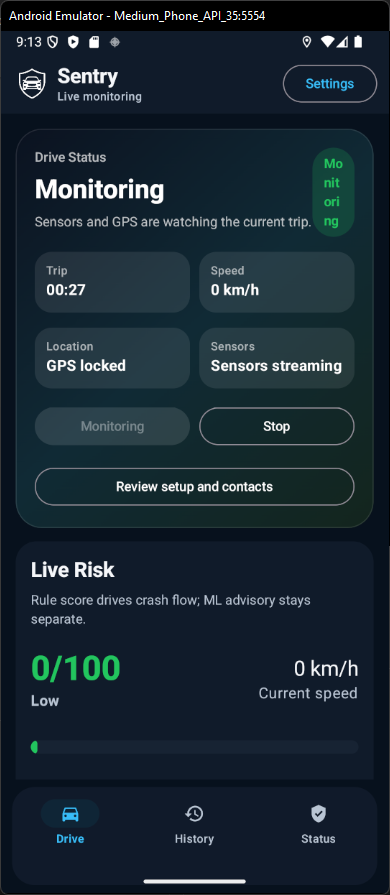

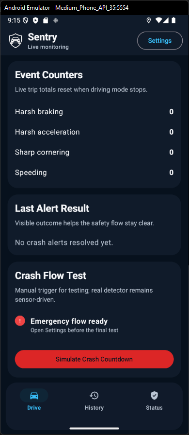

Figure 4. Android Drive tab during active monitoring (parts 1-2).

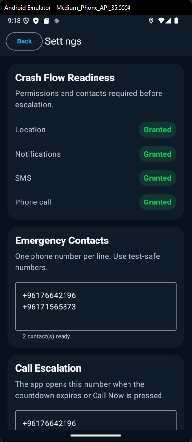

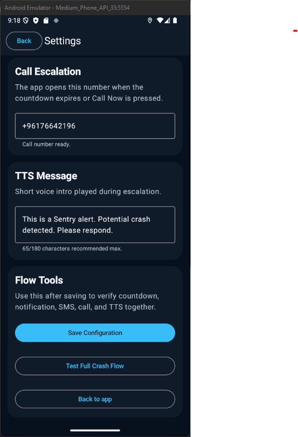

Figure 5. Android Settings screen with crash-flow configuration (parts 1-2).

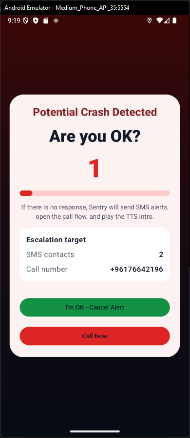

Figure 6. Android crash countdown and escalation confirmation screen.

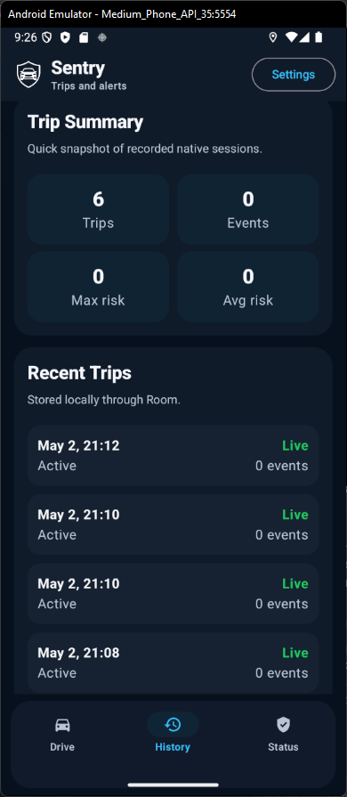

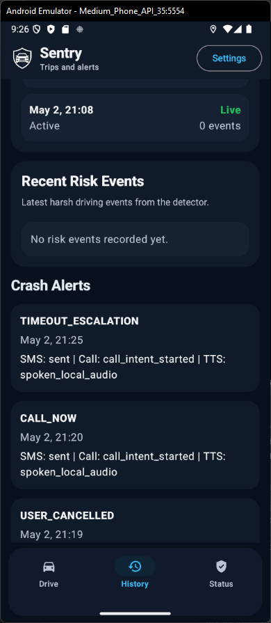

Figure 7. Android History tab with persisted trips and alert logs (parts 1-2).

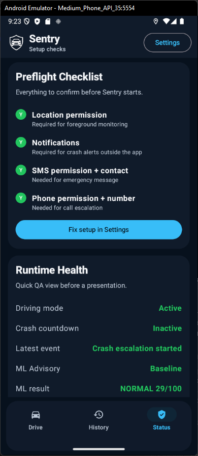

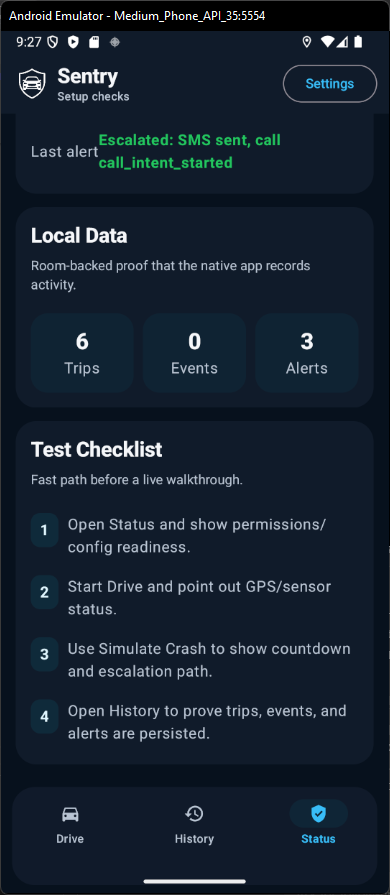

Figure 8. Android Status tab showing permissions and readiness (parts 1-2).

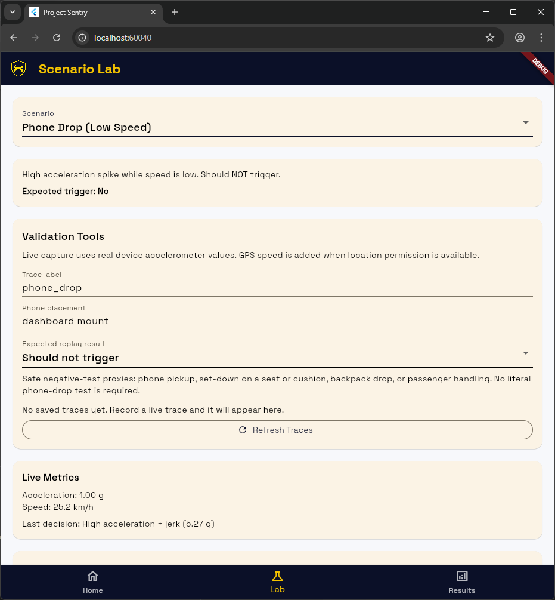

Figure 9. Flutter Scenario Lab with deterministic playback controls and validation tools.

The originally planned Figure 10 content, the Flutter live-capture validation card with the location-permission notice, is captured in the combined Figure 9 screenshot to avoid repeating nearly identical UI context.

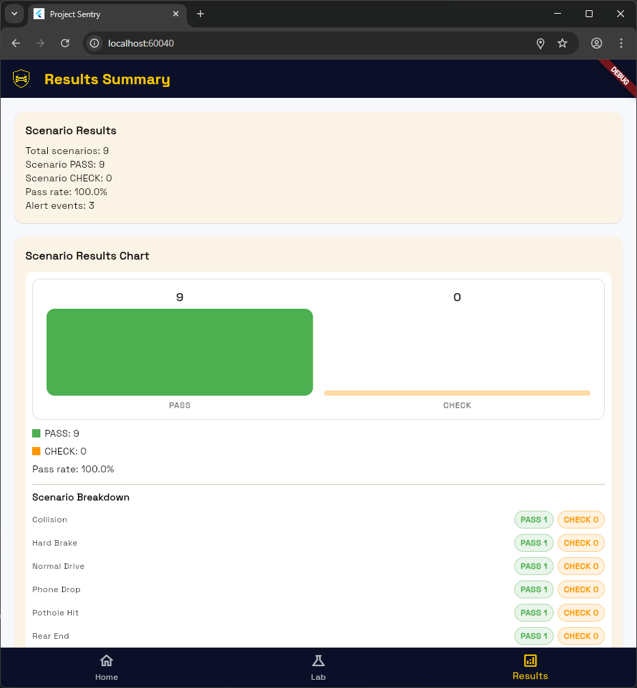

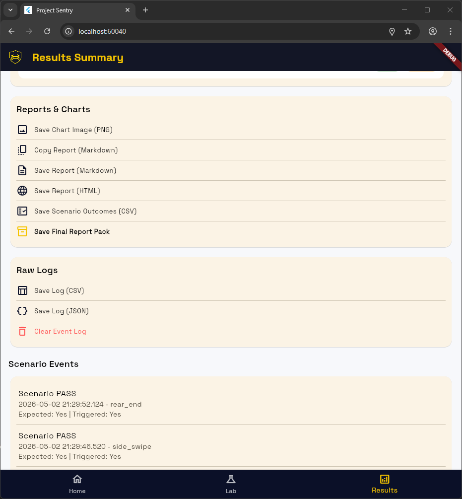

Figure 11. Flutter Results Summary screen with evaluation metrics (parts 1-2).

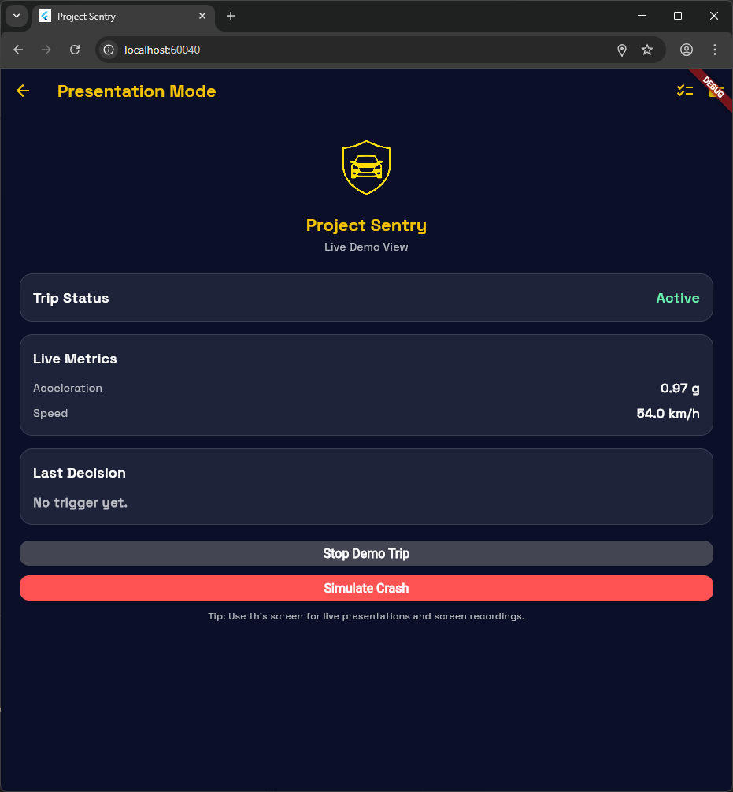

Figure 12. Flutter Presentation Mode screen used in capstone demos.

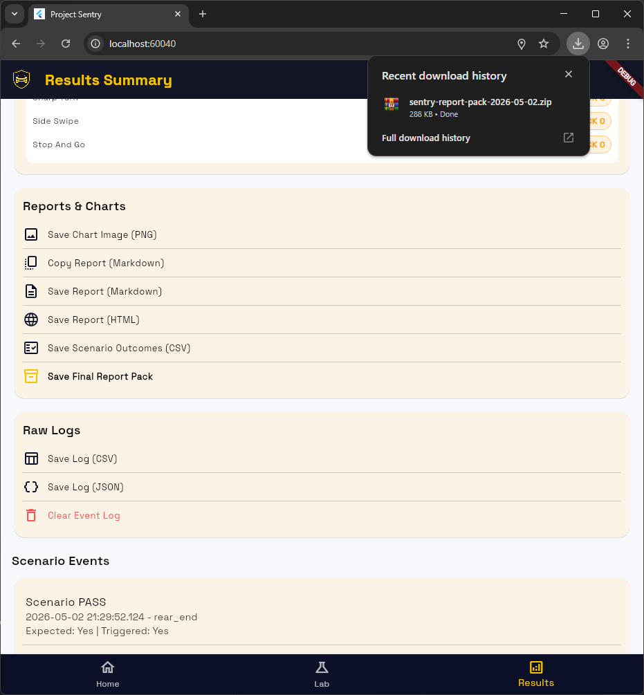

Figure 13. VS Code view of exported report-pack artifacts.

See `docs/Final_Report/figures-to-capture.md` for the companion capture checklist.

## 5. Testing and Evaluation

### 5.1 Test Plan

Project Sentry now has two testing tracks because the repository contains two purpose-built applications.

Track A focuses on the Flutter prototype:

- deterministic scenario playback,
- repeatable PASS/CHECK scenario batches,
- live sensor capture,
- replay of recorded traces,
- and export/report generation.

Track B focuses on the Android native MVP:

- foreground-service startup and shutdown,
- permission-request behavior,
- sensor and location monitoring,
- crash countdown behavior,
- SMS/call/TTS escalation,
- and Room persistence.

Track C focuses on advisory ML evaluation and integration:

- verified dataset-label mapping,
- feature extraction and preprocessing diagnostics,
- strict grouped cross-validation for held-session generalization,
- controlled random repeated validation as a dataset sanity check,
- exported JSON model loading in Android,
- and UI separation between advisory ML and crash-flow authority.

This three-track evaluation strategy is consistent with the actual repository structure and is explained explicitly in this report. It also strengthens verification quality: the Flutter layer supports deterministic and replayable validation, the Android layer exercises the platform-specific behaviors that matter most for runtime credibility, and the ML layer provides measured but conservative evidence for advisory risk classification. Together, they provide a stronger validation story than any one layer would provide alone.

### 5.2 Unit Testing Plan

The Flutter application already contains automated test files for:

- detection engine behavior,
- report generation,
- sensor trace encoding/decoding,
- trace evaluation,
- event-log export,
- configuration storage,
- and a widget-level home-screen smoke test.

At the time of writing, the repository contains 14 explicit Flutter tests across 7 test files. However, Flutter execution was not rerun on this documentation workstation because the `flutter` CLI is not installed here. This is reported as an environment limitation rather than hidden as a silent verification claim.

For Android, the Gradle unit-test task is configured, but as of April 26, 2026 it reported `NO-SOURCE`, which indicates that Android JVM unit tests have not yet been added. This should be reported honestly as a testing gap rather than hidden.

### 5.3 Integration Testing Plan

Important integration scenarios include:

- permissions plus foreground-service startup,
- sensors plus location plus risk-event logic,
- crash-detection validation plus countdown launch,
- countdown resolution plus SMS/call/TTS escalation,
- and Room insert/query behavior plus UI presentation.

The repository's Android bug-fixing report documents manual QA attention in these areas, especially around permissions, false positives, notification behavior, history display, and countdown reliability.

### 5.4 System Testing Plan

System testing should cover complete user journeys rather than isolated functions:

1. Configure crash-flow settings.
2. Start driving mode.
3. Observe live risk indicators and event counters.
4. Trigger a simulated crash or validated test condition.
5. Confirm that the countdown appears and can be cancelled.
6. Allow timeout during a demo-safe run and verify escalation behavior.
7. Confirm that alert outcomes and trip data are visible in history/status screens.

For Flutter, system testing should include:

1. Run scripted scenarios from the Scenario Lab.
2. Verify PASS/CHECK outcomes.
3. Capture a safe live trace.
4. Replay the saved trace.
5. Generate the results summary and final report pack.

### 5.5 Permission-Flow Testing

Permission-flow testing is especially important because the Android MVP depends on location, notifications, SMS, and phone permissions. The repository's QA notes indicate that the permission flow was refined to avoid first-launch crashes and to delay foreground-service startup until required permissions are granted. This section is paired with screenshots and a short narrative walkthrough of:

- first launch,
- permission prompts,
- missing-permission fallback messaging,
- and preflight readiness indicators.

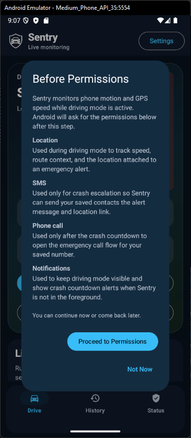

Figure 14. Android first-run permission request sequence.

The originally planned Figure 15 permissions checklist was intentionally omitted as redundant. The same permission-readiness evidence is already visible in Figure 8 and in the first-run permission flow shown in Figure 14.

### 5.6 Crash Simulation Testing

The safest current crash-demo path is the Android native "Simulate Crash" flow and the Flutter deterministic scenario flow. Both approaches avoid unsafe physical testing while still demonstrating the product behavior. The captured countdown screen, cancellation action, and escalation workflow document the crash-simulation evidence used in this final draft.

### 5.7 Risk-Event and Advisory-ML Testing

The Android MVP also supports non-crash risk-event logging, including harsh braking, harsh acceleration, sharp cornering, and speeding. This is valuable because it broadens the system from pure crash response into driver-risk monitoring. The repository does not contain a field-calibrated dataset for false alarms, event rates, or threshold calibration, so those measurements are treated as future validation work rather than current production claims.

The advisory ML model adds another evaluation layer. The repository now contains training outputs, diagnostics, strict grouped validation summaries, controlled random repeated summaries, confusion matrices, and exported JSON model assets. These artifacts support a concrete claim that advisory ML exists and has been evaluated on labeled public smartphone-sensor windows. They do not support a claim that ML crash detection has been validated in the field. The field-facing risk-event gap therefore remains: future physical-device runs should compare rule-based risk events, advisory ML labels, and human-observed labels on the same safe traces.

### 5.8 Emulator vs Physical Device Testing

The project can be partially demonstrated on emulators, especially for UI and flow review, but physical-device testing is more credible for:

- real sensor sampling,
- location and speed behavior,
- notification behavior,
- background activity restrictions,
- and telephony/TTS handling.

The Flutter validation workflow already anticipates physical-device trace capture, and the Android native MVP is clearly designed with real device behavior in mind. This final draft therefore distinguishes emulator/UI evidence from broader physical-device validation, and treats a larger device matrix as future engineering validation.

### 5.9 Current Verified Evidence

The following items were directly verified on May 2, 2026 after pulling commit `cdf6cbb Added advisory ML and improved crash detection stability`:

- `android-native\\gradlew.bat --no-daemon :app:assembleDebug` completed successfully.
- `android-native\\gradlew.bat --no-daemon :app:testDebugUnitTest` completed successfully, but the task still reported `NO-SOURCE`.
- `android-native\\gradlew.bat --no-daemon :app:lintDebug` completed successfully and wrote `android-native/app/build/reports/lint-results-debug.html`.
- The Android build emitted non-blocking warnings that Android Gradle Plugin `8.3.2` is not formally tested up to `compileSdk = 35`, and that the installed Android SDK command-line tooling encountered SDK XML version 4 metadata.
- The local environment has JDK 17 and an Android SDK installed.
- The local environment still does not expose the Flutter CLI on `PATH`, so Flutter app execution and Flutter test reruns were not freshly verified here.

These are the only build-verification claims treated as freshly confirmed in this report.

### 5.10 Evaluation Metrics and Current Status

The rubric expects actual evaluation, so this report includes measured and future-validation metrics wherever the current evidence allows it. Table 6 captures the current state honestly by separating what the repository already supports from what remains future engineering validation. This distinction is important: the project can already demonstrate credible workflow validation, build verification, visual evidence, and advisory ML evaluation, but it does not overclaim field-calibrated performance that has not yet been measured.

Table 6. Current evaluation metrics and future validation needs.

| Metric | Current Status | Evidence Available Now | Future Validation Need |
| --- | --- | --- | --- |
| Detection latency | Pending | No final measured table in repo | Time countdown launch after trigger under controlled runs |
| False alarms per hour | Pending | Risk/collision logic exists, but no finalized field dataset | Collect repeated safe-drive traces and summarize false positives |
| SMS success | Partial | Code path exists and alert status is persisted | Demo-run table showing permission state and observed result |
| Call escalation success | Partial | Code path exists and alert status is persisted | Demo-run table showing `CALL_PHONE` or dialer behavior on device |
| TTS success | Partial | Code path exists and alert status is persisted | Device-level confirmation during timed crash demo |
| Risk-event accuracy | Pending | Heuristic logic exists | Controlled trace set with expected event labels |
| Advisory ML held-session performance | Implemented for advisory model | Strict grouped summaries in `ml/models/advisory-risk/` | More recordings, more devices, and local traces before production claims |
| Scenario PASS/CHECK rate | Partial | Flutter report/export code exists | Regenerate a final report pack and archive the outputs |

## 6. Entrepreneurial / Innovation Aspects

### 6.1 Market Relevance

The market relevance of Project Sentry begins with the Lebanese context before it extends outward to broader mobile-safety markets. WHO's Lebanon road-safety material describes chaotic traffic flows, serious underreporting, low seat-belt use, and weak enforcement across major safety behaviors, while the Lebanon country profile reports an estimated road-traffic fatality rate of 22.6 per 100,000 population and the absence of a lead road-safety agency in the 2015 profile snapshot (World Health Organization, 2015; WHO EMRO, n.d.). Those conditions make a low-cost, smartphone-based monitoring and alert workflow especially relevant for Lebanese users, because the barrier to adoption is lower than dedicated vehicle hardware and the need for clearer post-crash communication remains high.

At the broader level, road traffic injuries remain a major global problem, with approximately 1.19 million deaths per year and tens of millions of non-fatal injuries worldwide (World Health Organization, 2023). In the U.S. context, NHTSA (2026) continues to publish annual fatality estimates and distracted-driving harm data, reinforcing that post-crash response and safer driving behavior remain meaningful product areas rather than solved problems.

At the same time, the hardware base needed for a phone-centered safety solution already exists at scale. Pew Research Center (2025) reports that 91% of U.S. adults own a smartphone, which means motion sensing, location, local storage, and communication tools are already widely distributed. Commercial traction also exists in adjacent safety markets: Life360 (2025) reported approximately 88.0 million monthly active users and 2.5 million paying circles in Q2 2025. Taken together, these sources support the conclusion that the problem is real, the delivery medium is practical, and the market is already conditioned to accept mobile safety products.

### 6.2 Existing Market Systems

The most relevant comparison set for Project Sentry is Apple Crash Detection, Google Pixel Car Crash Detection, and Life360. The purpose of the comparison is not to argue that a student-built system beats those platforms. Instead, it is to show where established products are strongest and where Project Sentry's educational value is different: transparency, inspectable logic, local-first data handling, and extensibility.

Table 7. Competitor comparison across mainstream smartphone crash-detection systems.

| Product | Supported devices / platform | Automatic detection | Emergency workflow | Contacts / location workflow | Pricing / notable limitation |
| --- | --- | --- | --- | --- | --- |
| Apple Crash Detection | iPhone 14 or later | Yes; detects a severe car crash and starts a visible countdown (Apple, n.d.) | Automatically calls emergency services after about 20 seconds if not cancelled | Can notify emergency contacts and provide coordinates/search radius | Included on supported Apple hardware; tied to Apple device ecosystem |
| Google Pixel Car Crash Detection | Pixel 4a and later, including Fold, in supported regions | Yes; uses location, motion sensors, and nearby sounds (Google, n.d.) | Can call emergency services through Emergency Location Service | Can share location and use Emergency Sharing with contacts | Included on supported Pixel devices; requires permissions, supported regions, and working phone service |
| Life360 Crash Detection | Smartphone app with region and membership constraints | Yes; detects significant impact while driving and checks on the user (Life360, n.d.-a) | Can contact the user and, in some countries or tiers, dispatch emergency services | Uses emergency contacts and continuous location-sharing permissions (Life360, n.d.-b, n.d.-c) | Wider device reach, but depends on account setup, always-on permissions, and in some cases paid memberships |

This comparison highlights an important point for the report: commercial systems optimize for polished deployment and large-scale service integration, while Project Sentry optimizes for architectural clarity and traceable engineering decisions.

### 6.3 Why This Project Is Still Valuable

Project Sentry remains valuable even in the presence of established consumer products because it targets a different outcome. Its contribution is not market dominance; it is transparency. The project exposes design tradeoffs clearly, separates runtime-critical Android responsibilities from presentation-oriented Flutter tooling, supports reproducible scenario-based validation, and makes its limitations explicit rather than hiding them behind proprietary claims.

This is especially relevant in an academic setting. Students and reviewers can inspect how sensor features are turned into decisions, how countdown confirmation reduces false alarms, how local persistence supports after-action inspection, and how a mobile MVP must adapt to real Android permission and service constraints. Its strongest value is therefore as an engineering, validation, and experimentation platform.

### 6.4 Survey Evidence

The team also conducted a lightweight survey to support the entrepreneurial and user-validation discussion. The captured survey evidence below uses aggregate or redacted response screenshots. Names, emails, phone numbers, and private respondent identifiers should remain excluded from the final PDF.

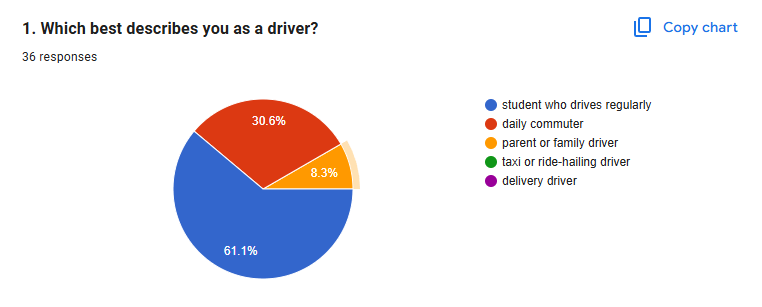

Figure 16. Survey response overview for Project Sentry.

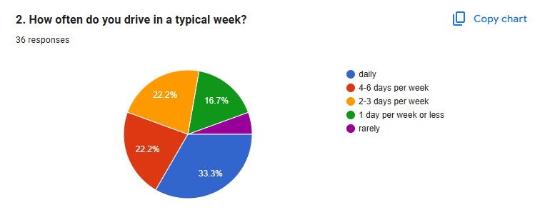

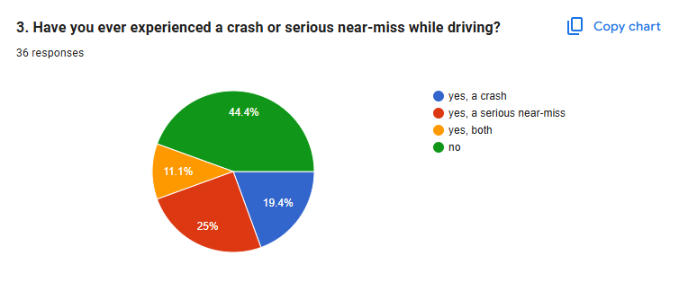

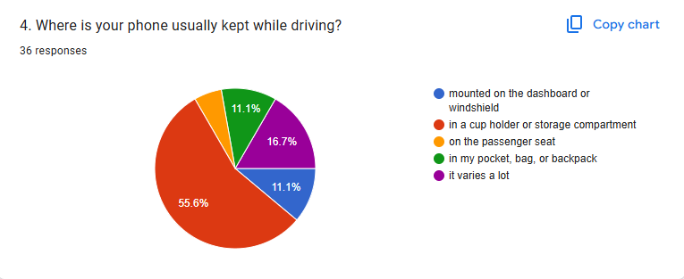

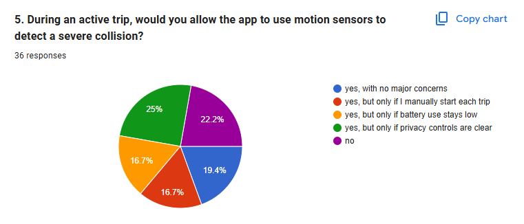

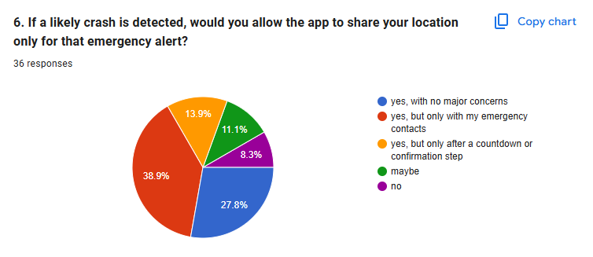

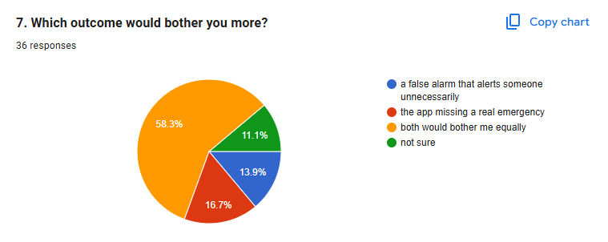

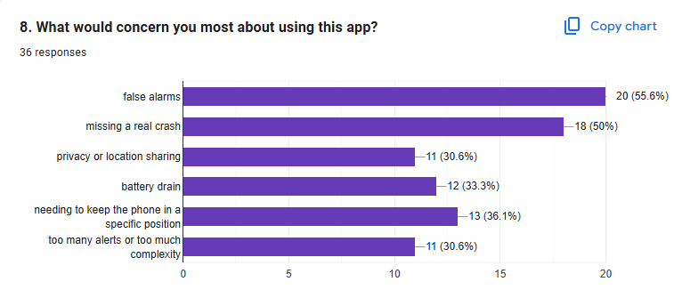

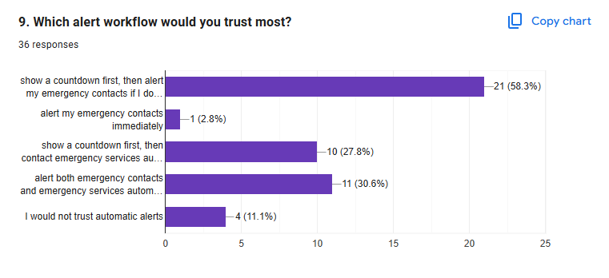

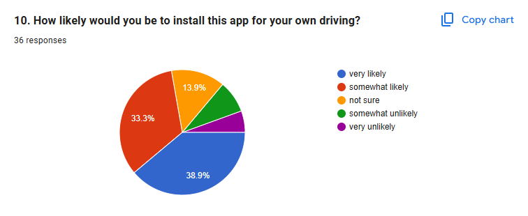

Figure 17. Survey response charts for trust, privacy, and adoption questions (parts 1-9).

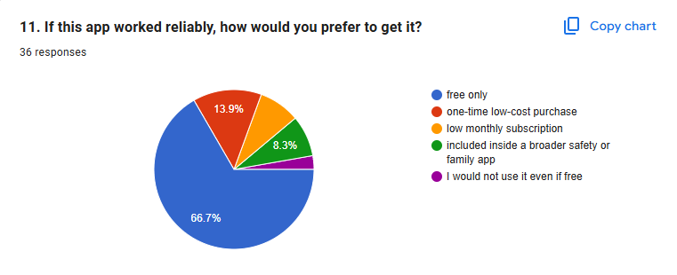

Figure 18. Survey open-ended response themes.

These survey figures should be discussed conservatively. They can support the claim that the team gathered early user feedback, but they should not be presented as statistically representative market research unless the final response count and sampling method justify that claim.

### 6.5 Possible Commercialization

Potential commercialization paths could include a safe-driving companion app with local risk scoring, a family safety tool centered on emergency-contact workflows, or a research-grade telematics add-on for student, fleet, or public-safety studies. A more specialized path would be to use Project Sentry as a white-label prototype or a foundation for later partnership work where validation, policy review, and backend infrastructure are added incrementally.

Any commercialization claim must remain conditional. Before deployment beyond capstone scope, the current system would need stronger calibration, broader device testing, legal and policy review, stronger service reliability guarantees, and a clearer operating model for emergency handling and user support.

### 6.6 Deployment and Scalability

From a deployment perspective, the Android native MVP is the more scalable technical foundation because it already owns the platform-specific runtime behavior that matters most: foreground monitoring, permissions, location, telephony, and persistence. The Flutter layer can continue to serve as a supporting interface for demos, validation, and future reporting workflows.

Long-term scalability would require more than simply adding users. It would require modularized detector logic, stronger automated test coverage, clearer device-compatibility support, better calibration across phone placements and sensors, and a more formal policy for updates, privacy, retention, and failure handling. Those are exactly the issues that separate a promising capstone MVP from a deployable safety product.

### 6.7 Societal and Ethical Impact

Societal value comes from the possibility of faster awareness and safer incident response, but societal risk comes from false reassurance, false escalation, excessive permission access, and user over-trust. Project Sentry is therefore described as a working MVP rather than a certified emergency service. This is not a weakness; it is an ethical requirement for accuracy. Because the system can monitor motion, use location, write local safety records, and attempt SMS/call escalation, the central ethical concerns are consent, permission scope, local data retention, visibility of active monitoring, and the user's ability to cancel a false alert.

The repository’s lightweight interview snapshot provides early qualitative support for the chosen workflow. Participants reportedly prioritized fast emergency assistance after a serious incident, preferred reliable countdown-based confirmation over opaque automation, showed little resistance to motion sensing or emergency-only location sharing, and considered a missed real emergency worse than a false alarm. They also noted that perceived reliability depends on phone placement, with mounted or visible positions feeling more trustworthy than phones buried in bags or backpacks. This is not a large-scale user study, and it should not be presented as one. However, it is still useful directional evidence that the project’s emphasis on a visible countdown, emergency-contact workflow, and transparent limitations aligns with plausible user trust expectations.

## 7. Project Management and Teamwork

### 7.1 Team Roles

The repository confirms the technical workstreams even though it does not encode ownership metadata directly. The role split below therefore identifies primary responsibility rather than exclusive contribution. Both team members contributed across the repository, but Hicham Saad led the Android-native runtime work while Jawad Saad led the Flutter prototype, reporting flow, and presentation-oriented work.

Table 8. Team roles and repository-backed ownership areas.

| Role Area | Repository-Backed Responsibility | Evidence | Final Owner |
| --- | --- | --- | --- |
| Android native runtime | Foreground service, sensors, location, permissions, Room persistence, crash countdown, SMS/call/TTS escalation | `android-native/app/src/main/java/com/safedrive/ai/` | **Hicham Saad (primary), Jawad Saad (shared)** |
| Flutter prototype and validation | Scenario Lab, live trace capture, replay evaluation, presentation mode, results summary, report exports | `flutter-app/lib/`, `flutter-app/test/` | **Jawad Saad (primary), Hicham Saad (shared)** |
| Documentation and report integration | Architecture notes, evaluation plan, ethics, traceability, demo guidance, final report draft | `docs/`, `demo/`, `docs/Final_Report/` | **Shared equally** |
| Research and market analysis | Related-work notes, validation planning, benchmark references, market framing | `docs/research/`, `docs/references.md` | **Shared equally** |
| Advisory ML training and Android integration | Training pipeline, diagnostics, exported JSON models, and Android advisory classifier | `ml/`, `android-native/app/src/main/java/com/safedrive/ai/ml/` | **Hicham Saad (primary), Jawad Saad (report integration)** |

### 7.2 Timeline

The local Git history is sufficient to reconstruct a defensible implementation timeline even if a separate Gantt chart was not preserved. Table 8 summarizes the major phases visible in the repository.

Table 9. Repository-backed project timeline and milestones.

| Date | Repository Evidence | Report Interpretation |
| --- | --- | --- |
| February 4, 2026 | `0928c6e Initial commit` | Initial project setup and early scope formation |
| April 11, 2026 | `07ac247`, `485ffe2`, `b029349`, `c75d231` | Documentation stabilization, research handoff, validation planning, and build-state capture |
| April 12, 2026 | `ee586e5 merged repo: flutter-app + android-native` | Formal convergence of the two implementation tracks into one capstone repository |
| April 13, 2026 | `95c5390 Small fixes` | Immediate refinement after the merge |
| April 22, 2026 | `9dcbbd4 Stabilize native Android demo and clean repo` | Native MVP hardening and demo readiness work |
| April 28, 2026 | `647d7e9 Add final report draft` | Final report assembly stage begins |
| May 2, 2026 | `cdf6cbb Added advisory ML and improved crash detection stability` | Advisory ML training/export and Android-native model integration added |

This table already provides the repo-backed chronology required for the report. A matching Gantt-style figure can be added later if desired, using the same phases shown here: Flutter prototype, Android native MVP, documentation/reporting, and validation/evidence capture.

### 7.3 Milestones

The following milestones are already supported by repository artifacts and can be cited without inventing extra project-management data:

1. Early project setup completed by February 4, 2026.
2. Research notes, validation workflow, and current build documentation were preserved on April 11, 2026.
3. The two major codebases were merged into one repository on April 12, 2026.
4. Post-merge fixes were applied on April 13, 2026.
5. Native Android demo stabilization and cleanup were completed on April 22, 2026.
6. The formal final-report drafting phase started on April 28, 2026.
7. Advisory ML integration and crash-detection stability work landed on May 2, 2026.

If advisor meeting notes exist, they can be added as external checkpoints beside these milestones rather than replacing them.

### 7.4 GitHub Collaboration

The unified repository itself is evidence of a structured collaboration approach. GitHub served as the shared version-control platform, while the repository layout kept the major streams of work separated by purpose: `flutter-app/` for simulation and reporting, `android-native/` for the runtime MVP, `docs/` for capstone evidence, and `ml/` for advisory machine-learning training and export work. This structure reduced the risk of unsupported claims by making each workstream visible and reviewable.

The visible local history currently includes ten top-level commits between February 4, 2026 and May 2, 2026. The most important collaboration checkpoints preserved in Git are:

- `b029349 Add trace validation workflow and research handoff docs`
- `c75d231 Add current build snapshot docs`
- `ee586e5 merged repo: flutter-app + android-native`
- `9dcbbd4 Stabilize native Android demo and clean repo`
- `647d7e9 Add final report draft`
- `cdf6cbb Added advisory ML and improved crash detection stability`

This is enough evidence to state that the team used repository-based coordination, incremental integration, and documentation-backed development. This report does not claim pull-request review practices or branch policies because no screenshots or logs for those workflows are currently preserved.

### 7.5 Resource Management

The main project resources are:

- Android Studio and Android SDK,
- JDK 17,
- Flutter SDK,
- Android devices or emulators,
- documentation time for evidence capture,
- and safe testing conditions.

This report also notes the project constraint that some validation depends on the availability of physical Android hardware and safe conditions for motion capture.

### 7.6 Advisor Context and Interaction Limits

Dr. Mohamed Watfa served as the capstone supervisor and provided the academic framing under which the project had to be documented: full-lifecycle software engineering, clear alignment with course learning outcomes, and a report structure that connects implementation to analysis, validation, and project management. Because the repository does not preserve formal meeting logs or dated advisory minutes, this report does not invent a detailed advisor-meeting timeline. What can be stated conservatively is that the final structure of the repository and report reflects advisor-compatible priorities: defensible scope, strong documentation, explicit limitation reporting, and a complete SDLC narrative rather than a feature-only demo description.

## 8. Results and Discussion

### 8.1 Current Achieved Outcomes

Based on the repository as it exists today, the project has already achieved the following:

- a working Android native MVP with service-based monitoring and local crash workflow,
- a working Flutter prototype for simulation, validation, and evidence export,
- an advisory ML classifier trained and exported as Android-readable JSON assets,
- a Room-backed local data model for trips, events, and crash outcomes,
- a privacy-conscious architecture that keeps data local in the MVP stage,
- and a documentation set that explains architecture, evaluation, ethics, and future work.

### 8.2 Comparison to Objectives

Table 10. Comparison between stated objectives and achieved outcomes.

| Objective | Current Status | Evidence |
| --- | --- | --- |
| Smartphone-based monitoring and crash workflow | Largely achieved | Android native service, countdown, escalation code |
| Native Android MVP for platform-critical features | Achieved | `android-native/` structure and verified Gradle checks |
| Validation and presentation layer | Achieved | Flutter Scenario Lab, Results Summary, report exports |
| Privacy-first local MVP | Achieved | Local Room storage and ethics documentation |
| Advisory ML without overstated crash authority | Achieved for advisory scope | `ml/models/advisory-risk/`, Android JSON assets, `AdvisoryRiskClassifier.kt` |
| Honest limitation reporting | Achieved | `docs/ethics-and-limitations.md`, strict grouped ML caveats, crash-flow limitations |
| Final quantitative evaluation package | Partial | ML metrics, visual evidence, and test plans exist; field/device metrics remain future validation work |

### 8.3 Strengths

The strongest aspects of the project are:

- honest separation of concerns between prototype UI/validation and runtime-critical Android behavior,
- a defensible engineering pivot rather than forced architectural compromise,
- local persistence and visible operational history in the Android MVP,
- clear human-in-the-loop crash escalation through a countdown,
- a working advisory ML layer with documented training artifacts and conservative evaluation language,
- and good capstone communication support through the Flutter evidence layer.

### 8.4 Limitations

Important limitations explicitly acknowledged in this report include:

- final field metrics remain future validation work,
- Android unit tests remain a future engineering improvement,
- Flutter/native are intentionally not bridged into one runtime,
- advisory ML is deployed only as a separate risk signal and is not validated as crash detection,
- phone placement and device variation remain important unknowns,
- and emergency behavior is demo-oriented rather than production-certified.

### 8.5 Lessons Learned

Several lessons emerge from the current repository:

1. Cross-platform prototyping is valuable, but it does not remove platform realities.
2. Safety-critical mobile behavior requires attention to OS rules, permissions, and lifecycle behavior.
3. Advisory ML is useful when it is evaluated honestly and kept separate from safety-critical crash authority.
4. Validation tooling and documentation are not secondary work; they materially improve capstone quality.

### 8.6 Discussion of the Flutter-to-Android Pivot

The Flutter-to-Android pivot is one of the most important discussion points in this report. It is presented positively and professionally:

- Flutter was useful for rapid prototyping, scenario simulation, results visualization, and capstone storytelling.
- The team learned through technical exploration that the project's most safety-critical features depended on Android-native lifecycle and permission behavior.
- Instead of forcing an unstable cross-platform workaround, the team preserved Flutter where it added the most value and moved the final runtime MVP to the stack that best fit the problem.

This is a mature engineering decision because it prioritizes system fit, reliability, and honest scope management over attachment to an earlier implementation choice.

## 9. Conclusion and Future Work

### 9.1 Summary of Contributions

Project Sentry delivers a multi-layer capstone outcome with clear division of responsibility. The final product focus is a native Android MVP that performs foreground driving monitoring, sensor and location collection, staged crash validation, countdown-based user confirmation, SMS/call/TTS escalation, advisory ML risk classification, and Room-backed persistence. Supporting that final product is the Flutter validation and presentation app, which remains useful for scenario-driven validation, trace replay, presentation, and evidence export. The project therefore demonstrates not only technical implementation, but also sound architectural judgment and responsible documentation practice.

### 9.2 Future Improvements

Priority future work includes:

1. explore a true cross-platform product path so Project Sentry can eventually support both Android and iOS while preserving native reliability for safety-critical services,
2. define a stable shared core for detection features, trace formats, validation outputs, and report evidence so cross-platform work does not duplicate logic,
3. collect more anonymized local traces to improve advisory ML generalization,
4. evaluate whether advisory ML should influence non-emergency risk scoring after stronger validation,
5. improve the Android UI/UX and add richer native export/history features,
6. add trip history filtering, summaries, and export options,
7. expand physical-device testing across multiple Android phones and OS versions,
8. review Play Store, App Store, and policy implications for permissions, foreground services, SMS, calling, location, and emergency-style claims,
9. refactor Android detector logic into more testable classes,
10. add Android unit and instrumentation tests,
11. formalize broader market validation through a larger survey or more structured interviews.

## References

- Apple. (n.d.). *Manage Crash Detection on iPhone 14 or later*. Apple Support. Retrieved April 30, 2026, from https://support.apple.com/guide/iphone/manage-crash-detection-iph948a628e9/ios

- Ferreira Júnior, J., Carvalho, E., Ferreira, B. V., de Souza, C., Suhara, Y., Pentland, A., & Pessin, G. (2017). Driver behavior profiling: An investigation with different smartphone sensors and machine learning. *PLoS ONE, 12*(4), e0174959. https://doi.org/10.1371/journal.pone.0174959

- Google. (n.d.). *Get help in an emergency using your Pixel phone*. Pixel Phone Help. Retrieved April 30, 2026, from https://support.google.com/pixelphone/answer/7055029?hl=en

- jair-jr. (n.d.). *Driver Behavior Dataset* [Data set]. GitHub. Retrieved April 30, 2026, from https://github.com/jair-jr/driverBehaviorDataset

- Khandakar, A., Michelson, D. G., Naznine, M., Salam, A., Nahiduzzaman, M., Khan, K. M., Suganthan, P. N., Ayari, M. A., Menouar, H., & Haider, J. (2025). Harnessing smartphone sensors for enhanced road safety: A comprehensive dataset and review. *Scientific Data, 12*, Article 418. https://doi.org/10.1038/s41597-024-04193-0

- Life360. (n.d.-a). *Crash detection & location sharing*. Retrieved April 30, 2026, from https://support.life360.com/hc/en-us/articles/23053468035095-Crash-Detection-Location-Sharing

- Life360. (n.d.-b). *Emergency contacts*. Retrieved April 30, 2026, from https://support.life360.com/hc/en-us/articles/23053433936151-Life360-Emergency-Contacts

- Life360. (n.d.-c). *Life360 free crash detection*. Retrieved April 30, 2026, from https://support.life360.com/hc/en-us/articles/23053410919063-Life360-Free-Crash-Detection

- Life360. (2025, August 11). *Life360 reports record Q2 2025 results*. https://life360.gcs-web.com/news-releases/news-release-details/life360-reports-record-q2-2025-results

- Mobile-Telematics. (n.d.). *TelematicsApp-Android* [Computer software]. GitHub. Retrieved April 30, 2026, from https://github.com/Mobile-Telematics/TelematicsApp-Android

- National Highway Traffic Safety Administration. (2026, April 1). *2025 traffic death estimates & 2024 FARS*. https://www.nhtsa.gov/press-releases/traffic-deaths-2025-early-estimates-2024-annual

- Pew Research Center. (2025, November 20). *Mobile fact sheet*. https://www.pewresearch.org/internet/fact-sheet/mobile/

- World Health Organization. (2015). *Road safety Lebanon 2015 country profile*. https://www.who.int/publications/m/item/road-safety-lbn-2015-country-profile

- World Health Organization. (2023, December 13). *Road traffic injuries*. https://www.who.int/news-room/fact-sheets/detail/road-traffic-injuries

- World Health Organization, Regional Office for the Eastern Mediterranean. (n.d.). *Road safety*. https://www.emro.who.int/lbn/programmes/road-safety.html

## Appendices

### Appendix A. Installation Guide

This appendix consolidates the setup guidance scattered across the repository README files.

#### A.1 Shared Repository Prerequisites

- Git
- a code editor such as VS Code or Android Studio
- Android SDK for Android-related work
- JDK 17 for Gradle-based Android builds
- Flutter SDK for `flutter-app/`

#### A.2 Repository-Level Orientation

1. Clone the repository.
2. Review the root `README.md` for the division of responsibilities between the two applications.
3. Use `docs/repository-guide.md` to decide which application should be used for the intended demo or evaluation task.

#### A.3 Flutter Application Setup

1. Change into `flutter-app/`.
2. Run `flutter pub get`.
3. Start the app with one of the following targets:
   - `flutter run -d chrome` for a quick browser demo
   - `flutter run -d windows` for a desktop presentation
   - `flutter run -d android` for live sensor capture on an Android device
4. For screenshots, capture Scenario Lab after playback, Validation Tools or live capture, Results Summary, and Presentation Mode.
5. If SDK-path errors occur, create `flutter-app/android/local.properties` from `local.properties.example` and define `flutter.sdk` and `sdk.dir`.

#### A.4 Android Native Application Setup

1. Open `android-native/` directly in Android Studio or change into that directory in a terminal.
2. Build from the command line with `.\gradlew.bat assembleDebug` on Windows or `./gradlew assembleDebug` on macOS/Linux.
3. If Android SDK location errors occur, define `ANDROID_HOME` or create `local.properties` from `android-native/local.properties.example`. On a default Windows Android Studio install, the temporary PowerShell command is usually `$env:ANDROID_HOME = "$env:LOCALAPPDATA\Android\Sdk"`.
4. Run the app on an emulator or physical device with API 26 or higher.
5. Before testing crash behavior, configure demo-only contacts and demo-only phone numbers.
6. For screenshots, capture Settings, Drive with active monitoring and ML advisory visible, Crash Countdown after `Simulate Crash`, History after a session, and Status with permission readiness.

#### A.5 Survey Screenshot Preparation

1. Open the team's survey response dashboard.
2. Capture the response overview and total response count.
3. Capture the charts that best support trust, privacy, countdown confirmation, perceived usefulness, or adoption.
4. Redact or crop names, emails, phone numbers, or any private identifiers before inserting screenshots into Figures 16-18.

### Appendix B. User Manual

#### B.1 Flutter Prototype Workflow

The recommended class-presentation order is:

1. Open the Home screen.
2. Move to Scenario Lab and run a scripted scenario.
3. Review the Results tab and any PASS/CHECK summaries.
4. Open Presentation Mode for a polished walkthrough.
5. If needed, generate JSON, CSV, Markdown, HTML, or ZIP report artifacts from the results flow.

Use the Flutter app when the goal is simulation, validation, presentation, or capstone evidence export.

#### B.2 Android Native MVP Workflow

The Android MVP is intended for realistic runtime demonstrations:

1. Open Settings and configure demo-safe phone numbers plus optional TTS text.
2. Grant required permissions for location, notifications, SMS, and phone access as appropriate to the test scenario.
3. Start Driving Mode from the main runtime screen.
4. Observe live monitoring information such as counters, readiness, and risk indicators.
5. Trigger `Simulate Crash` or a controlled safe test condition.
6. Use the countdown screen to either cancel the alert or allow the timeout path to continue.
7. Review the History and Status views to confirm local persistence of trip and alert data.

Use the Android app when the goal is to demonstrate service-based monitoring, permissions, storage, and crash-escalation flow.

#### B.3 Demo Safety Rules

- Use placeholder or demo-only numbers.
- Do not place real emergency calls.
- Do not perform dangerous driving or real crash recreation.
- Keep screenshots and demo traces free of personal identifiers and sensitive locations.

### Appendix C. Structured Test Cases

Table C.1. Core Android-native test cases.

| Test ID | Objective | Steps | Expected Result |
| --- | --- | --- | --- |
| AN-TC-01 | Verify first-run permission flow | Install the app on a clean device, launch it, and respond to permission prompts | The app stays stable, shows permission requests cleanly, and does not start monitoring until required permissions are granted |
| AN-TC-02 | Verify driving-mode startup | Grant permissions, start Driving Mode, and observe the foreground notification | The service starts successfully, the notification remains visible, and live monitoring state updates are shown |
| AN-TC-03 | Verify simulated crash countdown | Start Driving Mode and trigger `Simulate Crash` | The countdown activity appears promptly and provides cancel and escalate actions |
| AN-TC-04 | Verify timeout escalation logging | Allow the countdown to expire during a demo-safe run | SMS/call/TTS pathways are attempted according to settings, and the outcome is stored locally |
| AN-TC-05 | Verify local persistence | Complete one monitored session and review History/Status screens | Trips, risk events, and crash-alert outcomes are visible after the session |

Table C.2. Core Flutter validation test cases.

| Test ID | Objective | Steps | Expected Result |
| --- | --- | --- | --- |
| FL-TC-01 | Verify scripted scenario playback | Open Scenario Lab and run a predefined scenario | The scenario plays deterministically and produces a visible PASS/CHECK-style result |
| FL-TC-02 | Verify live trace capture | Run the Flutter app on Android, start a safe capture session, and save the trace | A trace file is created and stored for later replay |
| FL-TC-03 | Verify replay evaluation | Load a saved trace and run replay evaluation | The replay produces metrics and an observed outcome without corrupting the original trace |
| FL-TC-04 | Verify report generation | Generate summary and export artifacts after scenarios or trace replay | JSON, CSV, Markdown, HTML, and ZIP outputs are created successfully |
| FL-TC-05 | Verify home-screen smoke behavior | Launch the Flutter app after clearing local config | The Home, Lab, Results, and Start Trip UI elements appear successfully |

Table C.3. Advisory ML test cases.

| Test ID | Objective | Steps | Expected Result |
| --- | --- | --- | --- |
| ML-TC-01 | Verify model artifacts exist | Check `ml/models/advisory-risk/` and Android assets | Training outputs and exported JSON models are present |
| ML-TC-02 | Verify label-mapping quality | Review `label_manifest.csv`, skipped recordings, and diagnostics | Only verified labels are used; uncertain Mendeley folders are skipped |
| ML-TC-03 | Verify Android model loading | Launch Android Driving Mode with bundled assets | UI reports a trained JSON advisory source rather than baseline-only |
| ML-TC-04 | Verify advisory separation | Trigger simulated crash flow while ML advisory is visible | Countdown/escalation follows rule-based crash logic, not ML label alone |

### Appendix D. Dataset and Model Details

The `ml/` directory now contains an implemented advisory model workflow. It should still be described conservatively: the model is deployed in Android as a risk advisory, not as the source of truth for crash detection or emergency escalation.

#### D.1 Current ML Workspace Structure

- `ml/data/` is intended for anonymized datasets and locally downloaded public data.
- `ml/src/sentry_ml/` contains preprocessing, feature extraction, training, evaluation, diagnostics, and JSON export code.
- `ml/notebooks/` is intended for exploratory analysis only.
- `ml/models/advisory-risk/` contains trained JSON artifacts, model-comparison files, strict grouped results, controlled random results, diagnostics, confusion matrices, and classification reports.
- `android-native/app/src/main/assets/` contains the exported advisory JSON models used by the Android app.

#### D.2 Dataset Position

The verified current training data comes from STRIDE-labeled smartphone-sensor recordings. The exported dataset summary reports 3,153 feature windows, 23 source recordings, and 36 features. The label counts are:

- `NORMAL`: 1,371 windows
- `ROAD_ANOMALY`: 989 windows
- `AGGRESSIVE`: 793 windows

The Mendeley dataset was inspected but skipped for training because the downloaded folders did not provide a verified folder-to-label mapping. This protects the report from claiming accuracy based on guessed labels.

#### D.3 Input Features

- accelerometer-derived magnitude
- jerk derived from successive acceleration magnitude changes
- gyroscope-informed rotational behavior
- combined motion features
- summary statistics such as mean, standard deviation, minimum, maximum, RMS, energy, percentiles, peak count, and signal magnitude area

#### D.4 Android Model Integration

The Android app currently prefers a two-task advisory runtime:

1. driver behavior model: logistic regression, `NORMAL` vs `AGGRESSIVE`
2. road condition model: random forest, `NORMAL_ROAD` vs `ROAD_ANOMALY`

The app also includes a three-class fallback model for `AGGRESSIVE`, `NORMAL`, and `ROAD_ANOMALY`. `AdvisoryRiskClassifier.kt` loads these JSON assets locally, computes features from recent sensor windows, smooths predictions, and publishes advisory label, score, confidence, and source values to the UI. Crash countdown and escalation remain controlled by the rule-based detector.

#### D.5 Privacy Constraints

- Do not commit personal identifiers.
- Do not commit raw sensitive location traces.
- Keep only the minimum data needed for validation and model development.

#### D.6 Remaining ML Work

1. Collect more anonymized local traces and labels.
2. Expand device and phone-placement diversity.
3. Compare advisory labels against safe real-world observations.
4. Evaluate latency, battery impact, and stability on Android devices.
5. Keep ML advisory-only unless stronger validation supports a broader role.

### Appendix E. GitHub and Repository Structure

The current repository structure is intentionally organized by responsibility:

```text
Project Sentry/
|-- android-native/
|-- demo/
|-- docs/
|   |-- Final_Report/
|   `-- research/
|-- flutter-app/
|-- ml/
|-- reports/
|-- LICENSE
|-- README.md
`-- sentry-report-pack-2026-04-11.zip
```

The collaboration workflow implied by this structure is:

1. Use `flutter-app/` for polished demo, validation, replay, and reporting work.
2. Use `android-native/` for real Android runtime behavior and service-based monitoring.
3. Keep architecture, ethics, evaluation, and final-report evidence in `docs/`.
4. Keep advisory ML training, diagnostics, and export artifacts in `ml/` and Android runtime assets in `android-native/app/src/main/assets/`.

The repository now includes a proprietary `LICENSE` file. The code,
documentation, assets, models, and related materials are reserved by the
Project Sentry Team and may be used only for authorized review, demonstration,
academic evaluation, or internal development.

Selected repository milestones that can be mentioned in the report include:

- February 4, 2026: initial setup commit
- April 11, 2026: research, validation, and build-snapshot documentation commits
- April 12, 2026: repository merge bringing Flutter and Android native work together
- April 22, 2026: native Android demo stabilization and cleanup
- April 28, 2026: final-report draft added to the repository
- May 2, 2026: advisory ML model and Android integration added to the repository

### Appendix F. Complete Survey Screenshot Sequence

This appendix preserves the full survey-results screenshot sequence captured for the final report. Chapter 6 uses the same evidence in grouped form, while this appendix keeps the complete ordered sequence available for review.


Figure F.1. Survey results sequence, part 1.


Figure F.2. Survey results sequence, part 2.


Figure F.3. Survey results sequence, part 3.


Figure F.4. Survey results sequence, part 4.


Figure F.5. Survey results sequence, part 5.


Figure F.6. Survey results sequence, part 6.


Figure F.7. Survey results sequence, part 7.


Figure F.8. Survey results sequence, part 8.


Figure F.9. Survey results sequence, part 9.


Figure F.10. Survey results sequence, part 10.


Figure F.11. Survey results sequence, part 11.
